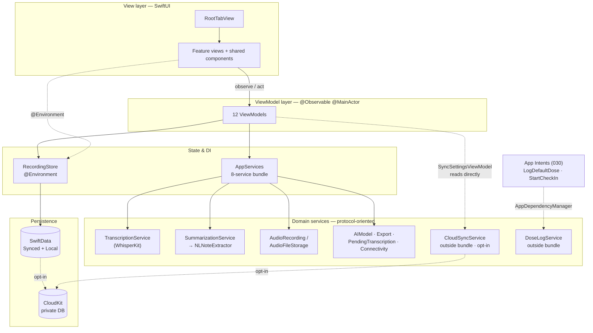
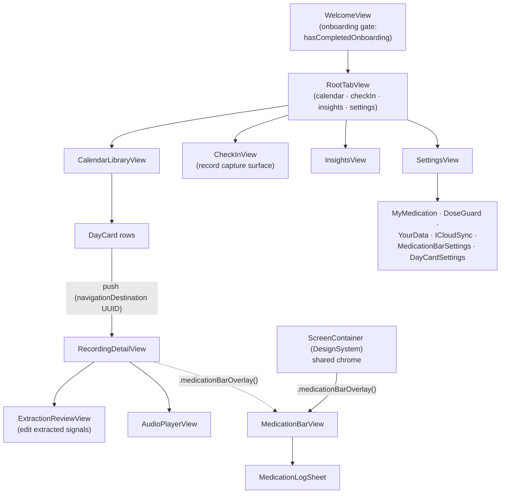
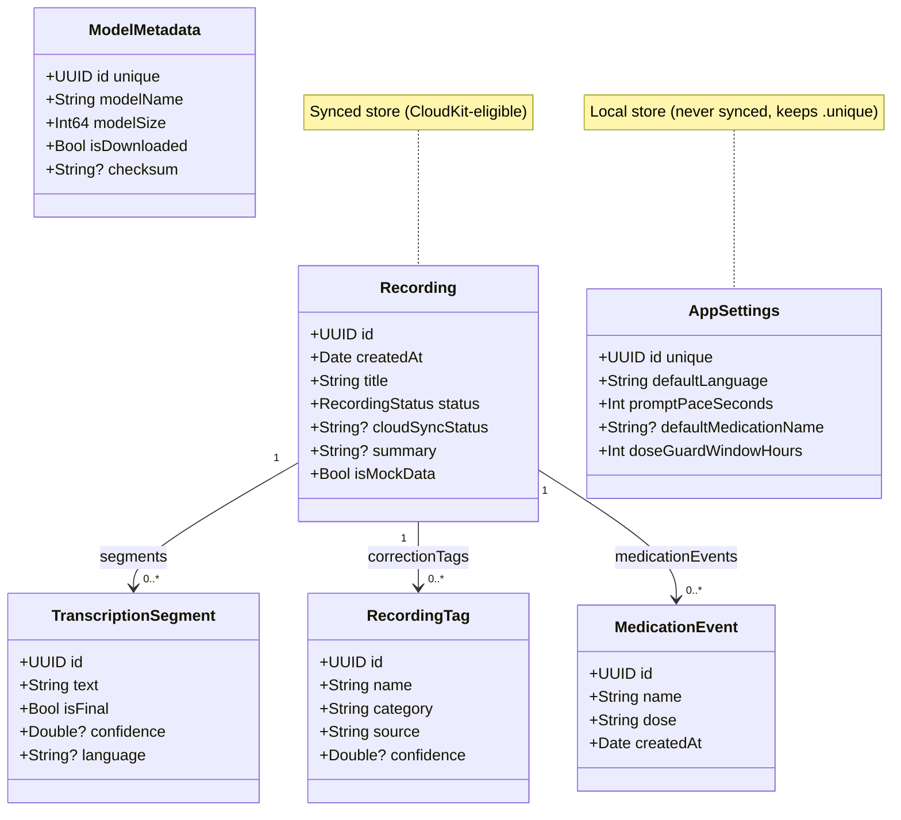
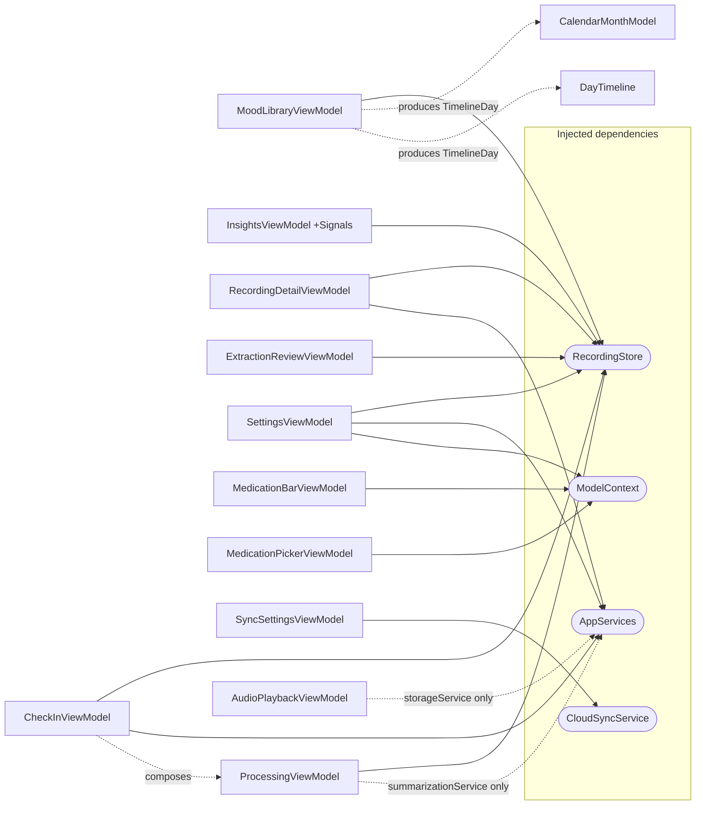
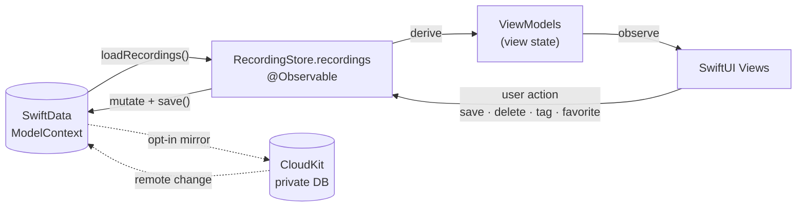

<!-- Created: 2026-07-18 18:40 (WEST) · Updated: 2026-07-20 09:20 (WEST) -->
# Architecture Diagrams — View · Model · ViewModel · Data Flow

_Last updated: 2026-07-20 · branch `feat/038-icloud-sync` · v0.8.0 (build 2)_

Rendered component and data-flow diagrams for Squirl's MVVM layers. Every node and edge is grounded in source; file references are given under each figure. Diagrams use [Mermaid](https://mermaid.js.org/) (renders on GitHub and in VS Code with a Mermaid preview extension). Companion to [ARCHITECTURE.md](ARCHITECTURE.md), [DATA_MODEL.md](DATA_MODEL.md), and [SERVICES.md](SERVICES.md). Offline HTML render: [preview/architecture-diagrams.html](preview/architecture-diagrams.html).

---

## Figure 1 — Layer overview

The MVVM spine: SwiftUI **Views** observe `@Observable` **ViewModels**, which read/write the centralized **`RecordingStore`** and call domain services. `AppServices` bundles exactly **8** services; `CloudSyncService` and `DoseLogService` live **outside** the bundle — sync is read directly by `SyncSettingsViewModel`, dose logging is resolved only by App Intents. Persistence is SwiftData (Synced + Local stores); CloudKit mirroring is opt-in and off by default (spec 038, in progress).



_Source: [AppServices.swift](../../app-four/Store/AppServices.swift) (8 members), [AppDependencies.swift](../../app-four/Store/AppDependencies.swift) (`doseLogService` L26, `cloudSyncService` L38 — separate statics), [SyncSettingsViewModel.swift](../../app-four/ViewModels/SyncSettingsViewModel.swift#L18), [SquirlApp.swift](../../app-four/App/SquirlApp.swift#L28) (intent wiring), [AppModelContainer.swift](../../app-four/App/AppModelContainer.swift)._

---

## Figure 2 — View components

Four tabs under `RootTabView`, plus a pre-tab onboarding gate and shared chrome. The medication bar is **not** owned by any one screen: `ScreenContainer` (DesignSystem) mounts it app-wide via `.medicationBarOverlay()`, and `RecordingDetailView` applies the same modifier; the bar presents `MedicationLogSheet` itself.



_Source: [RootTabView.swift](../../app-four/Views/RootTabView.swift), [CalendarLibraryView.swift](../../app-four/Views/Library/CalendarLibraryView.swift#L47) (DayCard L129, push L47-49), [ScreenContainer.swift](../../app-four/DesignSystem/ScreenContainer.swift#L79), [MedicationBarView.swift](../../app-four/Views/Components/MedicationBarView.swift#L41) (presents the sheet), [RecordingDetailView.swift](../../app-four/Views/RecordingDetailView.swift#L41), [SettingsView.swift](../../app-four/Views/SettingsView.swift#L54-L60) (+ L184/L188), [SquirlApp.swift](../../app-four/App/SquirlApp.swift#L83-L105) (gate)._

---

## Figure 3 — Model components (SwiftData schema)

Six `@Model` types under `SquirlSchemaV1`. `Recording` is the aggregate root with three optional to-many relationships (arrays are optional per CloudKit requirements). The container partitions models into a **Synced** store and a **Local** store; only Local models keep `@Attribute(.unique)`.



_Source: [Recording.swift](../../app-four/Models/Recording.swift#L9-L69) (`status: RecordingStatus` L15), [TranscriptionSegment.swift](../../app-four/Models/TranscriptionSegment.swift), [RecordingTag.swift](../../app-four/Models/RecordingTag.swift), [MedicationEvent.swift](../../app-four/Models/MedicationEvent.swift), [AppSettings.swift](../../app-four/Models/AppSettings.swift), [ModelMetadata.swift](../../app-four/Models/ModelMetadata.swift), [SquirlSchema.swift](../../app-four/App/SquirlSchema.swift)._

---

## Figure 4 — ViewModel components & dependencies

All 12 ViewModels are `@Observable @MainActor final class`. Solid edges = the whole dependency; **dotted edges = a single service extracted from the bundle**, not the bundle itself. `ProcessingViewModel` is composed by `CheckInViewModel` (no view owns it); `SyncSettingsViewModel` reads `CloudSyncService` directly and is driven by Settings' `ICloudSyncSection`.



_Source: [ViewModels/](../../app-four/ViewModels/). Init signatures: `CheckInViewModel(store:services:)` (composes `ProcessingViewModel` at [L94](../../app-four/ViewModels/CheckInViewModel.swift#L94)), `ProcessingViewModel(store:summarizationService:)`, `AudioPlaybackViewModel(recording:storageService:)`, `SyncSettingsViewModel(service:)` ([L18](../../app-four/ViewModels/SyncSettingsViewModel.swift#L18), consumed by [ICloudSyncSection.swift:7](../../app-four/Views/Settings/ICloudSyncSection.swift#L7)). `RecordingDetailViewModel`/`AudioPlaybackViewModel`/`ExtractionReviewViewModel` additionally take the target `Recording`. `WelcomeViewModel()` takes no dependencies._

---

## Figure 5 — Data flow: capture → transcribe → extract → persist (write path)

The live write pipeline runs **inside `CheckInViewModel`**: it saves the note, streams transcription itself, then hands the raw text to its composed `ProcessingViewModel`, which extracts and applies results to the `Recording` model. `PendingTranscriptionService` is the **recovery lane** — a serialized, oldest-first drain of any backlog, triggered from `SquirlApp` at launch, on foregrounding, and when the Whisper model finishes downloading.

```mermaid
sequenceDiagram
    actor User
    participant CV as CheckInView
    participant CVM as CheckInViewModel
    participant AR as AudioRecordingService
    participant Store as RecordingStore
    participant PVM as ProcessingViewModel
    participant TS as TranscriptionService
    participant NL as NLSummarization
    participant Rec as Recording (model)
    participant SD as SwiftData

    User->>CV: tap record
    CV->>CVM: startRecording()
    CVM->>AR: startRecording() + audio-level stream
    User->>CV: tap stop
    CV->>CVM: stopRecording()
    CVM->>Store: addRecording(...)
    Store->>SD: insert + save
    Note over CVM: status .pendingTranscription → transcribeInBackground()
    CVM->>TS: transcribe(audioURL) segment stream
    TS-->>CVM: text segments
    CVM->>Store: save() (streamed text)
    CVM->>PVM: processRawTranscription(...)
    PVM->>NL: summarize(rawTranscription)
    NL-->>PVM: SummaryResult (summary · tags · med events)
    PVM->>Rec: applySummary + setMedicationEvents
    PVM->>Store: save() → status .completed
    SD-->>CV: @Observable change → UI refresh
    Note over Store,SD: Recovery lane — PendingTranscriptionService.drainIfModelReady()<br/>(launch · foreground · model-ready) drains pending notes oldest-first,<br/>serialized; writes fullTranscriptText, then the same applySummary path
```

_Source: [CheckInViewModel.swift](../../app-four/ViewModels/CheckInViewModel.swift) (`addRecording` L192, `.pendingTranscription` L204, `transcribeInBackground` L213/247, `processRawTranscription` L261/L429), [ProcessingViewModel.swift](../../app-four/ViewModels/ProcessingViewModel.swift), [Recording.swift](../../app-four/Models/Recording.swift#L215) (`applySummary` L215, `setMedicationEvents` L314), [PendingTranscriptionServiceImpl.swift](../../app-four/Services/PendingTranscriptionServiceImpl.swift#L107) (`writeSegment` sets `fullTranscriptText`, not a `TranscriptionSegment` row), [SquirlApp.swift](../../app-four/App/SquirlApp.swift#L115) (drain triggers L115/L118/L151)._

---

## Figure 6 — Data flow: observation & read path

The reactive loop. SwiftData is the source of truth; `RecordingStore.recordings` is the observed collection; ViewModels derive view state from it; Views observe and re-render. User actions call back into the store/VMs, which mutate the context and `save()`, closing the loop. Opt-in CloudKit sync mirrors the Synced store across the user's devices.



_Source: [Store/RecordingStore.swift](../../app-four/Store/RecordingStore.swift) (`loadRecordings`, `save`, `toggleFavorite`, `updateTitle`, `addCorrectionTags`), [App/AppModelContainer.swift](../../app-four/App/AppModelContainer.swift)._

---

### Notes & caveats

- **Spec 038 (iCloud sync)** is scaffolded and now has a working-tree UI consumer (`SyncSettingsViewModel` + `ICloudSyncSection`), but everything is **uncommitted** and the iCloud entitlement is not in the build target. CloudKit edges are drawn dashed and labelled opt-in.
- **`JournalExportSection.swift`** exists on disk but the symbol is mounted nowhere (grep-verified); export UI lives in `YourDataSection`. It is omitted from Figure 2.
- Field lists in Figure 3 are representative (most load-bearing columns), not exhaustive — see [DATA_MODEL.md](DATA_MODEL.md) for the full schema.
