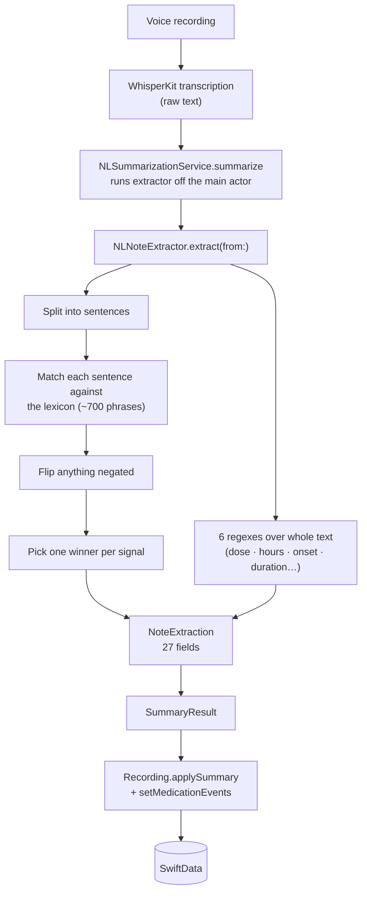
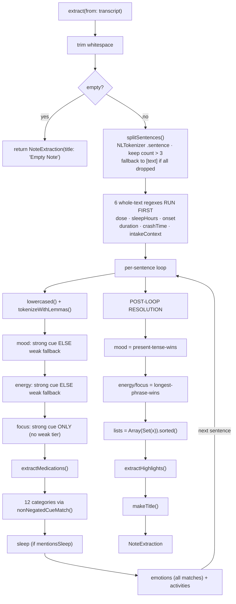
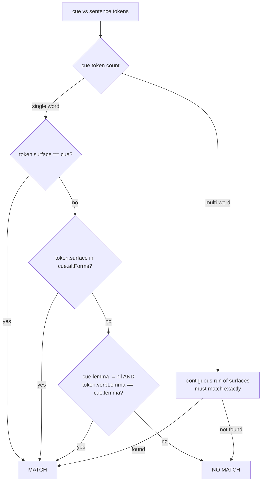
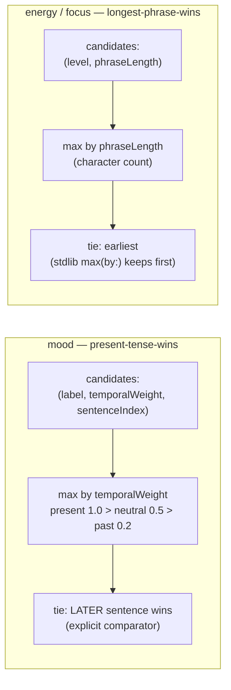
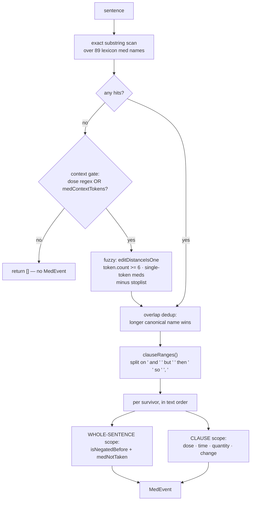
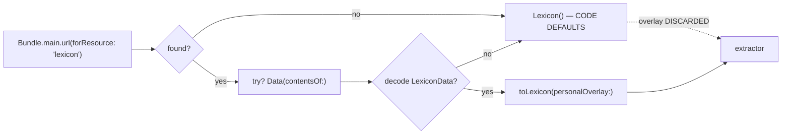
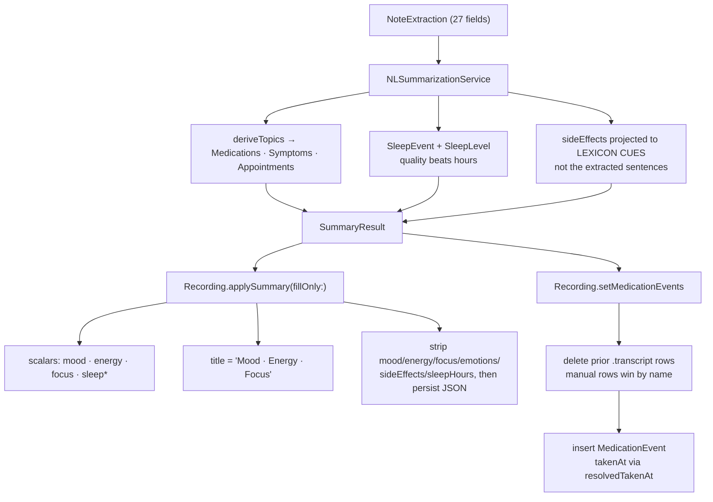

<!-- Created: 2026-07-20 22:01 (WEST) · Updated: 2026-07-20 22:01 (WEST) -->
# The NLP Extractor — From Transcription to Signals

_Last updated: 2026-07-20 · branch `feat/038-icloud-sync` · v0.8.0 (build 2)_

How a raw voice transcript becomes structured ADHD signals (mood, energy, focus, medications, sleep, emotions, highlights). **Code is the only source of truth for this document** — every claim below carries a `file:line` reference and was verified against the executable statements, not against comments (several comments in this subsystem are stale, and those are called out explicitly).

**Scope:** 7 files, ~2,110 lines, plus a 32-key `lexicon.json`.

| File | Lines | Role |
|---|---:|---|
| [NLNoteExtractor.swift](../../app-four/Services/NoteExtraction/NLNoteExtractor.swift) | 1,041 | The whole pipeline: orchestration, detection, regexes |
| [Lexicon.swift](../../app-four/Services/NoteExtraction/Lexicon.swift) | 396 | 32-field vocabulary value type + code defaults |
| [NoteExtraction.swift](../../app-four/Services/NoteExtraction/NoteExtraction.swift) | 201 | Output contract (27 fields) + `NoteExtractor` protocol |
| [CueMatcher.swift](../../app-four/Services/NoteExtraction/CueMatcher.swift) | 200 | Tokenisation + the single matching primitive |
| [LexiconData.swift](../../app-four/Services/NoteExtraction/LexiconData.swift) | 130 | Codable mirror + bundled-JSON loader |
| [TenseClassifier.swift](../../app-four/Services/NoteExtraction/TenseClassifier.swift) | 97 | present/past/neutral → temporal weight |
| [PersonalLexiconBuilder.swift](../../app-four/Services/NoteExtraction/PersonalLexiconBuilder.swift) | 45 | User-correction overlay (**not wired** — see §9.4) |

---

# Part 1 — The basic explanation

## 1.1 What it is

It is **not** machine learning. There is no model, no embedding, no network call, no download. It is a **hand-curated dictionary plus regular expressions**, running entirely on-device in a few milliseconds.

The only Apple framework used is `NaturalLanguage`, and only for three mechanical jobs: splitting text into sentences, splitting sentences into words, and asking "is this word a verb, and what's its base form?" ([NLNoteExtractor.swift:2](../../app-four/Services/NoteExtraction/NLNoteExtractor.swift#L2), [CueMatcher.swift:58-79](../../app-four/Services/NoteExtraction/CueMatcher.swift#L58-L79)).

Sentiment analysis was deliberately **removed**. The comment at [NLNoteExtractor.swift:258-263](../../app-four/Services/NoteExtraction/NLNoteExtractor.swift#L258-L263) records why: `NLTagger` paragraph sentiment scored neutral factual sentences at −0.6 to −0.8, so it fabricated "low" moods on mood-free notes. Mood is now exact lexicon matching only.

## 1.2 The idea in one paragraph

Take the transcript. Cut it into sentences. For each sentence, check it against ~700 curated words and phrases ("wired", "can't focus", "took my Concerta"). Every phrase that matches is tagged with what it means. Check whether a negation word sits just before the match — if so, flip the meaning. Collect all the matches from all the sentences, then apply a **tie-break policy per signal** to pick one winner for mood, energy and focus. Separately, run six regular expressions over the whole transcript to pull out numbers (dose, hours slept, onset minutes). Score every sentence for how much it says, keep the best few as highlights, and title the note from the first of those.

## 1.3 Basic flow



## 1.4 What comes out

A `NoteExtraction` with 27 fields ([NoteExtraction.swift:5-35](../../app-four/Services/NoteExtraction/NoteExtraction.swift#L5-L35)):

- **Three headline signals** — `mood` (String), `energy` (`EnergyLevel`), `focus` (`FocusLevel`)
- **Medications** — `[MedEvent]`, each with name, dose, time, taken/not-taken, half-dose, started/stopped
- **Sleep** — `SleepNote` (mentioned, hours, quality)
- **Emotions** — from a curated 20-emotion set
- **Twelve sentence-collecting categories** — side effects, tasks done/avoided, wins, overwhelm, executive dysfunction, physical stim, rebound, appetite loss/return, appointments
- **Six regex scalars** — dose, sleep hours, onset minutes, duration hours, crash time, intake context
- **`highlights`** (≤5 sentences) and **`title`**

---

# Part 2 — Full detail

## 2. Entry, threading, and the extractor object

### 2.1 Where it is called from

`NLSummarizationService` is the only production `SummarizationService` ([AppDependencies.swift:27](../../app-four/Store/AppDependencies.swift#L27)). Its `summarize` runs the synchronous extractor on a detached task:

```swift
await Task.detached(priority: .userInitiated) { extractor.extract(from: transcript) }.value
```
[NLSummarizationService.swift:24-29](../../app-four/Services/NLSummarizationService.swift#L24-L29)

`NLNoteExtractor` is declared `public nonisolated struct` ([NLNoteExtractor.swift:11](../../app-four/Services/NoteExtraction/NLNoteExtractor.swift#L11)) specifically because the project sets `SWIFT_DEFAULT_ACTOR_ISOLATION = MainActor`; without `nonisolated`, every helper would be main-actor-bound and `extract(from:)` could not call them off the main thread.

> ⚠️ **Cancellation is broken across this boundary.** The extractor politely polls `if Task.isCancelled { break }` between sentences ([NLNoteExtractor.swift:153](../../app-four/Services/NoteExtraction/NLNoteExtractor.swift#L153)), but `Task.detached` creates an *unstructured* task with no parent, so it can never observe the caller's cancellation. `ProcessingViewModel`'s `guard !Task.isCancelled` only discards the result *after* the full extraction has already run.

> ⚠️ `summarize` is declared `async throws` but contains no throwing statement — the `SummarizationError` cases are unreachable and the `catch` blocks in `ProcessingViewModel` are dead for the production service.

### 2.2 Init-time precomputation

Every lexicon cue is tokenised **once**, at `init`, into a `CachedCues` value holding **26** `CueList`s plus three `[(cue, label/level)]` arrays ([NLNoteExtractor.swift:21-38](../../app-four/Services/NoteExtraction/NLNoteExtractor.swift#L21-L38), built at [:58-95](../../app-four/Services/NoteExtraction/NLNoteExtractor.swift#L58-L95)). The hot loop never re-tokenises a cue.

Seven categories are built with **`lemmaEnabled: false`** — activities ([:45](../../app-four/Services/NoteExtraction/NLNoteExtractor.swift#L45)), sideEffect ([:60](../../app-four/Services/NoteExtraction/NLNoteExtractor.swift#L60)), physicalSideEffects, rebound, appetiteLoss, appetiteReturn, appointment ([:67-71](../../app-four/Services/NoteExtraction/NLNoteExtractor.swift#L67-L71)). The reason given at [:14-16](../../app-four/Services/NoteExtraction/NLNoteExtractor.swift#L14-L16): gerunds like "reading"→"read" cause polysemy false positives. Everything else gets the verb-lemma bridge.

## 3. `extract(from:)` — the control flow



Key ordering facts:
- The **six whole-text regexes run before the loop** ([:141-146](../../app-four/Services/NoteExtraction/NLNoteExtractor.swift#L141-L146)) and each takes only the **first** match in the transcript.
- Nothing is resolved inside the loop. The loop only **accumulates candidates**; every winner is chosen after it ([:265-283](../../app-four/Services/NoteExtraction/NLNoteExtractor.swift#L265-L283)).
- `splitSentences` keeps a sentence only if `sentence.count > 3` ([:337](../../app-four/Services/NoteExtraction/NLNoteExtractor.swift#L337)) — "Meh" (3) is dropped, "Bad." (4) survives — with a whole-text fallback at [:342](../../app-four/Services/NoteExtraction/NLNoteExtractor.swift#L342) only if *every* sentence was dropped.

## 4. The matching primitive

Everything routes through `CueMatcher.contains` ([CueMatcher.swift:175-199](../../app-four/Services/NoteExtraction/CueMatcher.swift#L175-L199)).



**Tokenisation** ([CueMatcher.swift:58-79](../../app-four/Services/NoteExtraction/CueMatcher.swift#L58-L79)) uses `NLTokenizer(unit: .word)` for boundaries — deliberately *not* `NLTagger`'s word enumeration, because that splits possessives ("doctor's" → "doctor" + "'s") and would let a bare "doctor" match the "doctor" cue. `verbLemma` is populated **only** when the token is tagged `.verb` and its lemma differs from the surface, which is what stops a noun ("wires") from lemma-matching a verb cue.

> ⚠️ **`altForms` is dead today.** `canonicalInflections` is an empty dictionary ([CueMatcher.swift:124](../../app-four/Services/NoteExtraction/CueMatcher.swift#L124)), so `makeList` always assigns `altForms = []`. The comment explains this table is the *simulator-safe* path, because the verb-lemma bridge rides `NLTagger`'s lemma model which is **absent on the iOS simulator** — meaning single-word verb cues can behave differently on sim vs device.

## 5. Mood, energy, focus

### 5.1 Two tiers

| Signal | Strong tier | Weak tier | Resolution policy |
|---|---|---|---|
| **mood** | `nearestMood` over lexicon `moodSpecific` | `weakMood` — only if sentence contains the word "mood" | **present-tense-wins** |
| **energy** | `nearestEnergy` over 5 level lists | `weakEnergy` — only if sentence contains "energy"/"energetic" | **longest-phrase-wins** |
| **focus** | `nearestFocus` over 5 level lists | **none** | **longest-phrase-wins** |

The weak tier is **all-or-nothing across the whole note**: `moodCandidates.isEmpty ? weakMoodCandidates : moodCandidates` ([:265](../../app-four/Services/NoteExtraction/NLNoteExtractor.swift#L265), [:277](../../app-four/Services/NoteExtraction/NLNoteExtractor.swift#L277)). One strong hit in the last sentence discards every weak candidate from all earlier sentences.

### 5.2 "nearest" is a misnomer

`nearestMood`/`nearestEnergy`/`nearestFocus` perform **no distance calculation of any kind** — no embedding, no proximity, no edit distance. The only ranking is `cue.surface.count`, the **character** length of the cue string ([:418](../../app-four/Services/NoteExtraction/NLNoteExtractor.swift#L418), [:428](../../app-four/Services/NoteExtraction/NLNoteExtractor.swift#L428), [:538](../../app-four/Services/NoteExtraction/NLNoteExtractor.swift#L538)).

Because it counts characters and not words, a long single word beats a short phrase: `"concentrating"` (13) beats `"on task"` (7). The comment at [:413-414](../../app-four/Services/NoteExtraction/NLNoteExtractor.swift#L413-L414) claiming "more words = more specific" is **stale** — word count is never consulted.

Comparison is strict `>`, so **equal-length ties are won by lexicon array order**, silently.

### 5.3 Negation

`isNegatedBefore` ([:351-368](../../app-four/Services/NoteExtraction/NLNoteExtractor.swift#L351-L368)) finds the target phrase, takes the text before it, splits on **spaces only**, and searches a window:

- token `"no"` → window is the **last 1 word**
- `"not"`, `"never"`, `"n't"` (suffix test), `"without"` → window is the **last 5 words**

Flip tables ([:370-398](../../app-four/Services/NoteExtraction/NLNoteExtractor.swift#L370-L398)):

| flipMood | flipEnergy | flipFocus |
|---|---|---|
| great→low, good→low, low→okay, okay→low, flat→okay | charged→sluggish, alert→tired, steady→tired, tired→steady, sluggish→alert | lockedIn→foggy, sharp→distracted, present→distracted, distracted→present, foggy→sharp |

None of these is an involution — `great→low→okay→low` never round-trips — and `flipEnergy`/`flipFocus` are non-injective (`sharp` and `present` both → `distracted`).

**Failure modes worth knowing:**
- Splitting on spaces means punctuation sticks: `"No, energy today"` yields the word `"no,"` which `!= "no"` and **does not negate**.
- The 1-word window for "no" means `"no energy"` negates but `"no real energy"` does not.
- If a cue matched via the lemma path, its canonical surface may not literally appear in the sentence — `text.range(of: target)` then fails and **negation is silently skipped**.

> 🐞 **Bug: "not energetic" is not negated.** `weakEnergy`'s gate accepts either "energy" or "energetic" ([:472](../../app-four/Services/NoteExtraction/NLNoteExtractor.swift#L472)), but its no-descriptor return uses the phrase `"energy"` ([:483](../../app-four/Services/NoteExtraction/NLNoteExtractor.swift#L483)). Since "energy" is not a substring of "energetic", `isNegatedBefore(target: "energy")` finds nothing, returns false, and *"not energetic today"* reports `.steady` instead of `.tired`.

### 5.4 Resolution policies



Note the asymmetry: mood's comparator **explicitly** encodes its tie-break ([:266-269](../../app-four/Services/NoteExtraction/NLNoteExtractor.swift#L266-L269)); energy and focus rely on `max(by:)` implementation behaviour and do not guarantee theirs.

### 5.5 The weak tables

`weakEnergyTable` — **59 entries**, first-match-wins in block order `.charged` (10) → `.tired` (32) → `.steady` (17) ([:450-467](../../app-four/Services/NoteExtraction/NLNoteExtractor.swift#L450-L467)). If no table word hits, it returns `.steady` with the phrase `"energy"` ([:483](../../app-four/Services/NoteExtraction/NLNoteExtractor.swift#L483)).

`weakMoodTable` — **46 entries**, blocks great (8) → low (17) → flat (1) → good (12) → okay (8) ([:489-502](../../app-four/Services/NoteExtraction/NLNoteExtractor.swift#L489-L502)). It **can never return nil** once "mood" appears: the final `return MoodMatch(label: "okay", …)` is unconditional ([:512](../../app-four/Services/NoteExtraction/NLNoteExtractor.swift#L512)). So the bare word "mood" anywhere in a note with no strong cue yields `mood == "okay"`.

> ⚠️ `energyProductRegex` (suppressing "energy drink/bar/gel") is **unreachable whenever any descriptor word is present**, because the table loop returns first ([:474-481](../../app-four/Services/NoteExtraction/NLNoteExtractor.swift#L474-L481)). *"the energy drink was great"* hits `"great"` and reports `.charged`.

## 6. Medication extraction



**Name matching is unanchored substring search** ([:555-561](../../app-four/Services/NoteExtraction/NLNoteExtractor.swift#L555-L561)) — no word boundaries. Short lexicon aliases fire inside longer words. The longest-name dedup ([:585-592](../../app-four/Services/NoteExtraction/NLNoteExtractor.swift#L585-L592)) rescues `amphetamine` inside `dextroamphetamine`, but not arbitrary substrings.

**Fuzzy typo tolerance** exists because the input is *speech-transcribed*: `CueMatcher.editDistanceIsOne` (Damerau-Levenshtein distance exactly 1, including adjacent transposition) is applied to tokens ≥6 chars, gated behind a context check, and only when there were **zero** exact hits ([:563-578](../../app-four/Services/NoteExtraction/NLNoteExtractor.swift#L563-L578)). A hard stoplist `["concert","concerts","concerto"]` prevents those from becoming "Concerta".

**Scope mismatch (important):** dose/time/quantity/change are read from the **clause**, but negation and not-taken are computed from the **whole sentence**, both locating the med by its *first* occurrence. When the same med appears twice in a sentence, both events get the taken-status of occurrence #1.

Key constants:
- `medNotTakenVerbs` = `forgot, missed, skipped, skip, forget` ([Lexicon.swift:370-372](../../app-four/Services/NoteExtraction/Lexicon.swift#L370-L372))
- `detectQuantity` returns only **0.5 or nil** — no other fraction is ever parsed ([:672-682](../../app-four/Services/NoteExtraction/NLNoteExtractor.swift#L672-L682))
- `stopTerms` are checked **before** `startTerms`, unconditionally ([:661-668](../../app-four/Services/NoteExtraction/NLNoteExtractor.swift#L661-L668))

> ⚠️ **`MedEventChange.regular` is never produced.** `detectMedChange` returns only `.stopped`, `.started`, or `nil`.
> ⚠️ **Time-of-day keywords never yield a clock time.** "morning"/"evening"/"lunch" set only `timeLabel`; `time` stays nil. The lexicon's normalisation (lunch→afternoon) is **discarded** by the `for (keyword, _)` destructuring ([:719-721](../../app-four/Services/NoteExtraction/NLNoteExtractor.swift#L719-L721)) — "lunch" is emitted as "lunch".
> ⚠️ **Two different dose regexes.** The fuzzy gate uses `ADHDRegexPatterns.doseRegex` (`\d{1,3}`, singular "milligram") while the emitted dose uses a local `doseRegex` (`\d+(?:\.\d+)?`, plural allowed). `"20 milligrams"` matches the emitter but **not** the gate.

### Worked example

Input: `"I took half my Concerta XL 36 mg around 10 am but skipped my Strattera in the evening"`

| Step | Result |
|---|---|
| Exact scan | hits: `Concerta`, `Concerta XL`, `Strattera` |
| Dedup | `Concerta` dropped — `Concerta XL` covers it and is longer |
| Clauses | A = `…around 10 am but `, B = `skipped my Strattera in the evening` |
| Event 1 | `MedEvent(name: "Concerta XL", dose: "36 mg", time: "10:00", timeLabel: "10 am", taken: true, quantity: 0.5)` |
| Event 2 | `MedEvent(name: "Strattera", timeLabel: "evening", taken: false)` — "skipped" found walking back before the clause break |

## 7. Sleep

Two independent parsers, and **the whole-text one wins**:

```swift
extraction.sleepHours = extractedSleepHours ?? sleepHours
```
[:314](../../app-four/Services/NoteExtraction/NLNoteExtractor.swift#L314)

| | Whole-text (`ADHDRegexPatterns`) | Per-sentence (instance) |
|---|---|---|
| Gate | trigger words (`slept, got, only, about…`) | caller's `mentionsSleep` |
| Numbers | digits only | digits **+ spelled-out one…twelve + "and a half"** |
| Activity-verb guard | **none** | yes (`hoursGovernedByActivityVerb`) |
| Precedence | **wins** | fallback only |

`hoursGovernedByActivityVerb` ([:792-801](../../app-four/Services/NoteExtraction/NLNoteExtractor.swift#L792-L801)) walks backwards from the number, skipping 19 filler words, and vetoes the match if it reaches one of 22 activity verbs (`worked, ran, drove, spent, studied…`) — so *"worked 12 hours"* is not read as sleep.

> 🐞 **Live bug — duration/sleep cross-contamination.** Because the whole-text regex wins and has **no** activity-verb guard, a medication-duration sentence like *"…lasted about 8 hours"* matches its `about` trigger and sets `sleepHours = 8.0` **and** `sleep.mentioned = true`, fabricating a sleep record from a duration statement. (The per-sentence parser's guard, which exists precisely to prevent this, is bypassed.)

> ⚠️ `"spent"` is in the veto list, so *"I spent 8 hours asleep"* is vetoed and returns **nil** — a false negative.
> ⚠️ `extractSleepQuality` uses unanchored `contains` and has **no negation handling at all** — *"no nightmares"* returns `"poor"`, and `"interested"` contains `"rested"` so it returns `"good"`.
> ⚠️ Precedence is good → poor → insomnia, so `"insomnia"` can only win when no other sleep vocabulary is present.

## 8. Highlights and title

**Scoring** ([:835-847](../../app-four/Services/NoteExtraction/NLNoteExtractor.swift#L835-L847)) — additive, each group fires at most once:

| Weight | Categories |
|---:|---|
| 3.0 | medications |
| 2.5 | wins · rebound |
| 2.0 | tasks (done\|avoided) · side effects (either list) · executive dysfunction |
| 1.5 | energy (any) · focus (any) · mood\|emotions · appetite (either) |
| 1.0 | timeOfDay |

Then length shaping: `+1.0` for 40–200 chars, `−1.0` for <20 chars ([:849-850](../../app-four/Services/NoteExtraction/NLNoteExtractor.swift#L849-L850)). Threshold to qualify is **≥1.5** ([:855](../../app-four/Services/NoteExtraction/NLNoteExtractor.swift#L855)); cap is `topN = min(5, max(1, sentences.count / 4 + 1))` ([:864](../../app-four/Services/NoteExtraction/NLNoteExtractor.swift#L864)).

Then **Jaccard dedup** at `> 0.6` surface-token overlap ([:883](../../app-four/Services/NoteExtraction/NLNoteExtractor.swift#L883)), then a **medication-coverage swap**: if no selected sentence mentions a med, the best med sentence is added — evicting the lowest-scored one only when already at 5 ([:889-901](../../app-four/Services/NoteExtraction/NLNoteExtractor.swift#L889-L901)).

> ⚠️ **`overwhelm`, `physicalStim`, `appointment` and `energySteady` do not contribute to highlights at all** — a sentence whose only content is overwhelm scores 0 from cues.
> ⚠️ **`CachedCues.energySteady` is a dead store** — populated at [:75](../../app-four/Services/NoteExtraction/NLNoteExtractor.swift#L75), never read anywhere.
> ⚠️ **"Title from top highlight" is wrong.** The comment at [:323](../../app-four/Services/NoteExtraction/NLNoteExtractor.swift#L323) says top highlight, but `selected` is index-sorted before returning, so `makeTitle` receives the **earliest** highlight. A 3.0-scoring medication sentence at the end of a note never titles it.

`makeTitle` ([:912-928](../../app-four/Services/NoteExtraction/NLNoteExtractor.swift#L912-L928)): cut at `,`/`;`, then `" and then "`, then `" but "`; strip leading fillers (`so, yeah, um, uh, like, okay, ok, well, anyway, right, honestly, basically`); take **8 words**; trim `". "`; capitalise the first character only. The empty-title fallback takes **6 words** from the raw transcript with no filler strip, no trim and no capitalisation.

## 9. The lexicon

### 9.1 Shape

`lexicon.json` has **32 keys / 718 top-level entries** ([lexicon.json](../../app-four/Resources/lexicon.json)). Largest: medications 89, moodSpecific 90, focusFoggy 38, energySluggish 37, executiveDysfunction 33.

### 9.2 Loading and silent failure



All 32 `LexiconData` properties are non-optional with no defaults, so **one missing key aborts the entire decode** and silently downgrades the vocabulary to the compiled defaults ([LexiconData.swift:122-127](../../app-four/Services/NoteExtraction/LexiconData.swift#L122-L127)). That is not a small difference — 18 of 32 keys are larger in JSON (medications 89→56, focusFoggy 38→23). There is no throw, no log, no flag; extraction just quietly gets worse. The `overlay` argument is also **dropped** on the fallback path.

### 9.3 Deliberate cross-category duplication

The same surface appears in multiple lists by design — `"nailed it"` is in moodSpecific(great), taskCompletionCues **and** winCues; `"feel heavy"` is both a mood(low) cue and an energySluggish cue. One sentence therefore populates several `NoteExtraction` arrays at once. Category counts are **not** disjoint.

### 9.4 The feedback loop is not wired

`PersonalLexiconBuilder.build` turns user-corrected `RecordingTag` rows into a `PersonalLexicon` overlay. A repo-wide grep finds **exactly two call sites, both in tests** ([PersonalLexiconTests.swift:28,39](../../app-fourTests/Services/PersonalLexiconTests.swift)). The only production construction is `NLSummarizationService()` at [AppDependencies.swift:27](../../app-four/Store/AppDependencies.swift#L27), which passes `personalOverlay: nil`.

**Consequence: in the shipping app, user corrections never feed back into extraction.** Also note `PersonalLexiconBuilder` only ever populates `medications` and `emotions` — never `moodSpecific` — and its unbounded `@MainActor` fetch would be a main-thread scan of every corrected tag ever written if it *were* wired.

> ⚠️ `TimeKeyword.normalized` is decoded, mapped and stored but **never read** by any consumer.

## 10. Tense classification

Three cases with ordinal weights ([TenseClassifier.swift:15-21](../../app-four/Services/NoteExtraction/TenseClassifier.swift#L15-L21)): `.present` 1.0, `.neutral` 0.5, `.past` 0.2. Detection is substring marker lists first, then an `NLTagger` verb-morphology fallback.

Its **only** consumer is mood aggregation — called at most **once per sentence**, inside the mood branches ([:163](../../app-four/Services/NoteExtraction/NLNoteExtractor.swift#L163), [:171](../../app-four/Services/NoteExtraction/NLNoteExtractor.swift#L171)). It never drops or down-weights any other category.

> 🐞 **Dead ternary.** `verbTense` ends `return sawVerb ? .neutral : .neutral` ([TenseClassifier.swift:90](../../app-four/Services/NoteExtraction/TenseClassifier.swift#L90)) — both branches identical, so `sawVerb` is a dead variable and `verbTense` can **never** return `.present`. Practical consequence: a mood sentence earns weight 1.0 **only** via an explicit present marker; verb morphology alone can never produce present tense.

## 11. Output contract and downstream landing



**`extraction.sideEffects` holds whole sentences**, not phrases ([:214](../../app-four/Services/NoteExtraction/NLNoteExtractor.swift#L214)). `NLSummarizationService` then inverts that into canonical **lexicon cues** by keeping each cue that some extracted sentence contains ([NLSummarizationService.swift:77-85](../../app-four/Services/NLSummarizationService.swift#L77-L85)) — so any extracted phrase containing no lexicon cue is silently dropped, and the raw sentences are blanked from the persisted JSON anyway.

Every collection field is `Array(Set(x)).sorted()` before leaving the extractor ([:286-306](../../app-four/Services/NoteExtraction/NLNoteExtractor.swift#L286-L306)) — **transcript order is destroyed**. Only `highlights`, `medications` and `emotions` keep their derived order.

**Persistence gotchas** in `applySummary` ([Recording.swift:215-297](../../app-four/Models/Recording.swift#L215-L297)):
- `sideEffectsJSON`, `sleepEventJSON`, `emotionsJSON`, `topicTagsJSON` are each written **only when non-empty** — a re-run that finds nothing leaves **stale** old values in place.
- The non-`fillOnly` branch assigns straight from the result, so a second extraction finding no mood **nulls** the previously populated column.
- `summaryStatus` is forced to `.completed` regardless of whether any JSON encode succeeded (all use silent `try?`).
- The **Regenerate path skips `setMedicationEvents`** entirely ([RecordingDetailViewModel.swift:134-150](../../app-four/ViewModels/RecordingDetailViewModel.swift#L134-L150)), so medication rows go stale while `medicationInfo` updates.

## 12. What the tests pin

**101 `@Test` cases across 14 files** (99 default, 2 env-gated), plus a 40-case labelled eval corpus (32 en / 4 pt / 4 es) with precision/recall floors that may only be ratcheted upward ([ExtractionEvalTests.swift:10-21](../../app-fourTests/Eval/ExtractionEvalTests.swift#L10-L21)):

| Category | Precision floor | Recall floor |
|---|---:|---:|
| medications | 0.980 | 0.980 |
| emotions | 0.920 | 0.647 |
| sleepHours | 0.980 | 0.550 |
| topics | 0.880 | 0.763 |
| mood | 0.730 | 0.580 |
| sideEffect flag | 0.730 | 0.410 |
| energy | 0.647 | 0.230 |
| **focus** | **0.380** | 0.313 |
| **activities** | **0.280** | 0.409 |

These floors are the honest self-assessment of the system: medications are near-exact; **focus and activities are weak axes**, and activities are noisy precisely because they are matched surface-only (`lemmaEnabled: false`).

> ⚠️ `EvalCounts(tp:0,fp:0,fn:0)` reports precision **and** recall of 1.0 ([EvalMetrics.swift:36-37](../../app-fourTests/Eval/EvalMetrics.swift#L36-L37)) — an all-nil category would trivially pass its floor.

## 13. Defect register

Findings from this review, in rough severity order. None is fixed; all are code-verified.

| # | Severity | Finding | Ref |
|---|---|---|---|
| 1 | **Bug** | Duration phrasing feeds the sleep field — whole-text sleep regex has no activity-verb guard and wins over the guarded parser | [:142](../../app-four/Services/NoteExtraction/NLNoteExtractor.swift#L142), [:314](../../app-four/Services/NoteExtraction/NLNoteExtractor.swift#L314) |
| 2 | **Bug** | `"not energetic"` never negates — gate accepts "energetic", negation target is "energy" | [:472](../../app-four/Services/NoteExtraction/NLNoteExtractor.swift#L472), [:483](../../app-four/Services/NoteExtraction/NLNoteExtractor.swift#L483) |
| 3 | **Bug** | `verbTense` dead ternary `sawVerb ? .neutral : .neutral`; can never return `.present` | [TenseClassifier.swift:90](../../app-four/Services/NoteExtraction/TenseClassifier.swift#L90) |
| 4 | **Bug** | `"interested"` contains `"rested"` → sleep quality `"good"`; `extractSleepQuality` also has no negation | [:806](../../app-four/Services/NoteExtraction/NLNoteExtractor.swift#L806) |
| 5 | High | Cancellation cannot reach the extractor (`Task.detached` has no parent) | [NLSummarizationService.swift:26](../../app-four/Services/NLSummarizationService.swift#L26) |
| 6 | High | Regenerate updates `medicationInfo` but never `setMedicationEvents` → stale rows | [RecordingDetailViewModel.swift:134-150](../../app-four/ViewModels/RecordingDetailViewModel.swift#L134-L150) |
| 7 | High | Empty results never clear persisted JSON → stale side effects / emotions / topics | [Recording.swift:269-291](../../app-four/Models/Recording.swift#L269-L291) |
| 8 | High | Corrupt/renamed `lexicon.json` silently downgrades vocabulary; overlay discarded | [LexiconData.swift:122-127](../../app-four/Services/NoteExtraction/LexiconData.swift#L122-L127) |
| 9 | Medium | `PersonalLexiconBuilder` unwired — user corrections never improve extraction | [PersonalLexiconBuilder.swift:11](../../app-four/Services/NoteExtraction/PersonalLexiconBuilder.swift#L11) |
| 10 | Medium | `"spent"` in veto list → *"spent 8 hours asleep"* returns nil | [:755-759](../../app-four/Services/NoteExtraction/NLNoteExtractor.swift#L755-L759) |
| 11 | Medium | Med negation/not-taken use whole-sentence scope + first occurrence, unlike clause-scoped attributes | [:604-605](../../app-four/Services/NoteExtraction/NLNoteExtractor.swift#L604-L605) |
| 12 | Low | Dead: `CachedCues.energySteady`, `canonicalInflections` (empty), `MedEventChange.regular`, `TimeKeyword.normalized`, `SleepEvent.bedtime/wakeTime/latencyMinutes`, `SummaryResult.hasMedication` | various |
| 13 | Low | Stale comments: "more words = more specific" ([:413](../../app-four/Services/NoteExtraction/NLNoteExtractor.swift#L413)), "title from top highlight" ([:323](../../app-four/Services/NoteExtraction/NLNoteExtractor.swift#L323)), mood "dark/high" ([NoteExtraction.swift:5](../../app-four/Services/NoteExtraction/NoteExtraction.swift#L5)) | various |

---

### Method note

This document was produced by 10 parallel deep-readers over the source, each paired with an adversarial verifier instructed to refute its claims against the code. 631 factual claims were checked; **66 were corrected** before writing, and the corrections are reflected above (entry counts, line refs, and several behavioural claims). Where a code comment and the executable statements disagreed, the statements won and the comment is flagged as stale.
