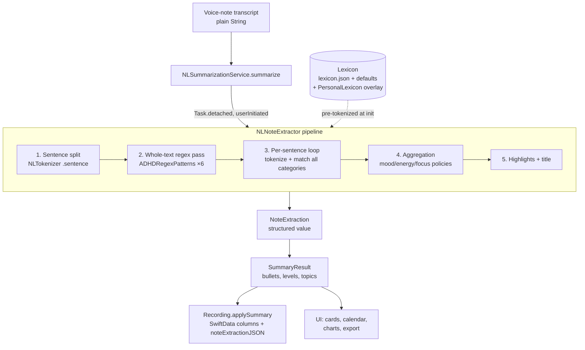
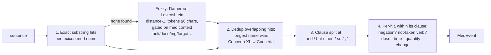
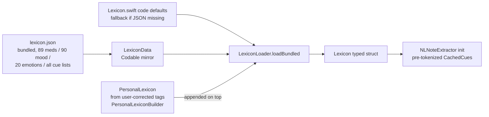

# NLP Signal Extraction — Full Technical Reference

How the app turns a voice-note transcript into structured ADHD-journal signals.
Everything described here is verified against the code, which is the source of truth.

**TL;DR:** The extractor is a fully on-device, deterministic, rule/lexicon-based pipeline
built on Apple's `NaturalLanguage` framework (`NLTokenizer`, `NLTagger`) plus curated
lexicons and hand-tuned regexes. There is **no ML model, no embeddings, no network call**.
It runs synchronously, off the main actor, in milliseconds.

---

## 1. Where it lives

| File | Lines | Role |
|---|---|---|
| `app-four/Services/NoteExtraction/NLNoteExtractor.swift` | 1041 | The extractor: pipeline orchestration, mood/energy/focus matching, medication extraction, sleep, highlights, title, `ADHDRegexPatterns` |
| `app-four/Services/NoteExtraction/CueMatcher.swift` | 200 | Tokenizer (surface + verb lemma), pre-tokenized cue lists, matching primitives, Damerau–Levenshtein |
| `app-four/Services/NoteExtraction/Lexicon.swift` | 396 | Typed `Lexicon` struct + hard-coded fallback vocabulary |
| `app-four/Services/NoteExtraction/LexiconData.swift` | 130 | Codable mirror of the lexicon; loads bundled `lexicon.json`; `PersonalLexicon` overlay |
| `app-four/Services/NoteExtraction/NoteExtraction.swift` | 201 | Output data model (`NoteExtraction`, `MedEvent`, `SleepNote`, `SleepEvent`, `NoteExtractor` protocol) |
| `app-four/Services/NoteExtraction/TenseClassifier.swift` | 97 | Present/past/neutral sentence tense for mood aggregation |
| `app-four/Services/NoteExtraction/PersonalLexiconBuilder.swift` | 45 | Builds `PersonalLexicon` from user-corrected tags (SwiftData) |
| `app-four/Resources/lexicon.json` | ~21 KB | Bundled production vocabulary: 89 meds, 90 mood entries, 20 emotions, all cue lists |
| `Packages/SquirlSignals/Sources/SquirlSignals/Levels.swift` | 99 | `MoodLevel`, `EnergyLevel`, `FocusLevel`, `SleepLevel` — shared 5-point level enums |
| `app-four/Services/NLSummarizationService.swift` | 104 | Adapter: runs extraction off-main, maps it to `SummaryResult`, topics, `SleepLevel` |

---

## 2. Architecture overview



### Data flow at a glance

| Stage | Input | Output | Code |
|---|---|---|---|
| Sentence split | raw transcript | `[String]` sentences (>3 chars) | `splitSentences` `NLNoteExtractor.swift:331` |
| Whole-text regex | full text | dose, sleepHours, onset, duration, crashTime, intakeContext | `ADHDRegexPatterns` `:936-1041` |
| Tokenization | sentence | `[CueMatcher.Token]` (surface + verb lemma) | `tokenizeWithLemmas` `CueMatcher.swift:58` |
| Cue matching | tokens + cue lists | per-category hits | `CueMatcher.contains` `:175` |
| Negation | matched phrase + sentence | flipped or kept label | `isNegatedBefore` `:351` |
| Tense | sentence | present/past/neutral → weight | `TenseClassifier.tense` `TenseClassifier.swift:40` |
| Aggregation | all candidates | headline mood/energy/focus | `:258-283` |
| Highlights | sentences | top-N salient sentences | `extractHighlights` `:820` |
| Title | top highlight | ≤8-word title | `makeTitle` `:912` |

---

## 3. The output schema — what a "signal" is

`NoteExtraction` (`NoteExtraction.swift:4-131`) is the full structured result.
Every field is a signal extracted from the text.

### 3.1 Scalar level signals

| Field | Type | Possible values | How derived |
|---|---|---|---|
| `mood` | `String?` (MoodLevel rawValue) | low / flat / okay / good / great | longest lexicon cue, negation-flipped, present-tense-wins |
| `energy` | `EnergyLevel?` | sluggish / tired / steady / alert / charged | longest lexicon phrase wins |
| `focus` | `FocusLevel?` | foggy / distracted / present / sharp / lockedIn | longest lexicon phrase wins |
| `sleep` | `SleepNote?` | mentioned + hours + quality (good/poor/insomnia) | sleep vocabulary + two-tier hours extraction |

The level enums live in `Packages/SquirlSignals/Sources/SquirlSignals/Levels.swift` and each
carries a `numericValue` of 1–5, which is what charts and the calendar day-cells render.

### 3.2 List signals (matched sentences / terms)

| Field | What it collects | Match rule |
|---|---|---|
| `emotions` | curated Mood-Meter emotions (20 entries) | every non-negated emotion cue, deduped |
| `activities` | 11 categories (resting, hobbies, fitness, …) | surface-only keyword match per category |
| `sideEffects` | sentences mentioning side effects | longest non-negated cue |
| `tasksCompleted` / `tasksAvoided` | sentences about done/avoided tasks | longest non-negated cue |
| `wins` / `overwhelm` | sentences about wins / overwhelm | longest non-negated cue |
| `executiveDysfunction` | exec-dysfunction sentences | longest non-negated cue |
| `physicalStim` | stimming sentences | longest non-negated cue |
| `physicalSideEffects` | physical side-effect sentences | longest non-negated cue |
| `reboundTerms` | med rebound/crash sentences | longest non-negated cue |
| `appetiteLoss` / `appetiteReturn` | appetite sentences | longest non-negated cue |
| `appointments` | appointment sentences | longest non-negated cue |

### 3.3 Medication events — `MedEvent` (`NoteExtraction.swift:139-159`)

| Field | Type | Meaning |
|---|---|---|
| `name` | `String` | canonical med name from the lexicon (89 meds bundled) |
| `dose` | `String?` | e.g. `"18mg"`, `"20mg XL"` (normalized from "milligrams") |
| `time` | `String?` | `"HH:mm"` 24h, from NSDataDetector |
| `timeLabel` | `String?` | raw phrasing, e.g. `"around 10 am"`, `"morning"` |
| `taken` | `Bool` | `false` when negated or forgot/missed/skipped before the med |
| `quantity` | `Double?` | `0.5` for "half a pill/tablet/dose", `nil` = full |
| `change` | `MedEventChange?` | `.started` / `.stopped` from start/stop term lists |
| `durationHours` | `Double?` | per-dose duration override |

### 3.4 Structured regex extractions

| Field | Example input → output |
|---|---|
| `extractedDose` | "20mg XL" → `"20mg XL"` |
| `sleepHours` | "slept 7 hours" → `7.0` |
| `onsetMinutes` | "kicks in after 45 minutes" → `45` |
| `durationHours` | "lasted 8 hours" → `8.0` |
| `crashTime` | "crash at 3pm" → `"crash at 3pm"` |
| `intakeContext` | "took on empty stomach" → `"empty stomach"` |

Plus `highlights: [String]` (salient sentences) and `title: String`.

---

## 4. The pipeline in detail

### 4.0 Init-time caching (done once)

At `init` (`NLNoteExtractor.swift:41-96`) every lexicon cue list is **pre-tokenized once**
into `CueMatcher.CueList`s inside a `CachedCues` struct. Mood/energy/focus entries keep
`(cue, label/level)` pairs so the per-sentence scan is a longest-match lookup, never a
re-tokenization. This is the main performance design decision: extraction is O(sentences × cues)
with tiny constants.

### 4.1 Step 1 — Sentence splitting

`NLTokenizer(unit: .sentence)` splits the transcript; sentences ≤ 3 characters are dropped
(`:331-343`). If the tokenizer yields nothing, the whole text is treated as one sentence.

### 4.2 Step 2 — Whole-text regex pass

Six statically-compiled `NSRegularExpression`s run over the **entire text once**
(`ADHDRegexPatterns`, `:936-1041`). Compiled once as `static let`, shared across all calls.

| Regex | Pattern (simplified) | Examples matched | Guard |
|---|---|---|---|
| Dose | `(\d{1,3})\s?(mg\|mcg\|milligram)\s?(XL\|XR\|IR\|…)?\s?(once\|twice\|daily\|…)?` | "18mg", "20mg XL" | — |
| Sleep hours | `(slept\|got\|in bed for\|…)\s?(\d{1,2})\s?(hours?\|hrs?\|h)` | "slept 7 hours" | trigger-word gated so it can scan whole text |
| Onset | `(kicks? in\|kicked in\|onset)\s*(in\|after\|…)*\s*(\d+)\s?(minutes?\|hours?)` | "kicks in after 45 minutes" | bare "took" excluded — collides with sleep latency |
| Duration | `(lasted\|duration\|worked for\|wore off after\|coverage)\s?(\d{1,2})\s?(hours?)` | "lasted 8 hours" | — |
| Crash time | `(crash\|rebound\|wore off\|hit a wall\|…)\s?(at\|around\|about)?\s?(\d{1,2}…)` | "crash at 3pm" | — |
| Intake context | `(took\|had\|with\|on)\s?(empty stomach\|with food\|with breakfast\|coffee\|…)` | "empty stomach" | — |

### 4.3 Step 3 — Per-sentence loop (`:150-256`)

For every sentence (checking `Task.isCancelled` between iterations so a long transcript
can be interrupted, returning the partial result):

```
sentence
  └─ CueMatcher.tokenizeWithLemmas → [Token(surface, verbLemma?)]
       ├─ mood     → nearestMood      → negation? flip → tense weight → candidate
       ├─ energy   → nearestEnergy    → negation? flip → candidate (else weakEnergy fallback)
       ├─ focus    → nearestFocus     → negation? flip → candidate
       ├─ meds     → extractMedications → [MedEvent]
       ├─ 12 topic categories → nonNegatedCueMatch → append sentence
       ├─ sleep    → mentionsSleep → hours + quality
       ├─ emotions → every non-negated cue → dedupe
       └─ activities → 11 category lists, surface-only
```

### 4.4 Tokenization & the matching primitive (`CueMatcher`)

**Tokenization** (`tokenizeWithLemmas`, `CueMatcher.swift:58-79`):

- Word boundaries come from `NLTokenizer` — deliberately **not** `NLTagger`'s `.word`
  enumeration, because that splits possessives/contractions ("doctor's" → "doctor" + "'s")
  which would let a bare "doctor" spuriously match the "doctor" cue.
- A single `NLTagger(tagSchemes: [.lexicalClass, .lemma])` is built per sentence; each
  token's **verb lemma is set only when the token is tagged `.verb`** and the lemma differs
  from the surface. A noun like "wires" gets `verbLemma == nil` and can never lemma-match.

**Matching** (`contains`, `:175-199`):

| Cue shape | Rule |
|---|---|
| Multi-word cue | contiguous run of surface tokens must equal the cue's token sequence |
| Single-word cue | exact surface match **OR** curated `altForms` (currently empty table) **OR** verb-lemma bridge |

The **verb-lemma bridge** requires *both* sides to be inflected verbs sharing a base form:
"panicking"/"panicked" → "panic" ✓, but base-form/state cues ("focus", "present", "clear")
keep surface-only matching, and nouns never bridge. This is what stops the lemma rule from
over-broadening precision.

**`lemmaEnabled`** is a per-category flag (`makeList`, `:106-113`):

| Lemma ON (default) | Lemma OFF (surface-only) |
|---|---|
| emotions, tasks, wins, overwhelm, exec dysfunction, mood, energy, focus | activities, side effects, physical side effects, rebound, appetite, appointments |

Rationale (in code comments): gerunds like "reading"→"read" cause polysemy false positives,
and the eval harness showed lemma-bridging hurt precision for those topic feeders.

### 4.5 Negation (`isNegatedBefore`, `:351-368`)

- Looks at the words **before** the matched phrase in the sentence.
- Window: **5 words** for all negation tokens, except **"no" which uses a window of 1**
  (must be the immediately preceding word — avoids false negation when "no" belongs to a
  different clause, e.g. "no special energy focus…").
- `n't` is matched by suffix (`word.hasSuffix("n't")`).
- Negation tokens come from the lexicon (`negationTokens`).

When negated, labels are flipped:

| flipMood | flipEnergy | flipFocus |
|---|---|---|
| great/good → low | charged → sluggish | lockedIn → foggy |
| low → okay | alert/steady → tired | sharp/present → distracted |
| okay → low | tired → steady | distracted → present |
| flat → okay | sluggish → alert | foggy → sharp |

### 4.6 Mood / energy / focus matching & weak fallbacks

**Strong matching** is identical for all three: scan the pre-tokenized
`(cue, label/level)` entries, keep the **longest** matching surface phrase
("feel nothing" beats "nothing"; "not bad" beats "bad").

**Weak fallbacks** fire only when no strong cue matched *in that sentence*, and are
**gated** so generic adjectives can never fire globally:

| Fallback | Gate | Descriptor table | Default |
|---|---|---|---|
| `weakMood` (`:505-513`) | sentence contains the word "mood" | ~50 words → great/low/flat/good/okay (extremes first) | "okay" |
| `weakEnergy` (`:470-484`) | sentence contains "energy"/"energetic" | ~60 words → charged/tired/steady | `.steady`, **unless** an "energy drink/bar/gel/shot/ball" product regex matches → nil |

Weak candidates are used **only if no strong cue matched anywhere in the whole note**
(resolved after the loop, `:265`, `:277`).

### 4.7 Tense classification (`TenseClassifier`)

Each mood candidate is tagged with its sentence's tense:

| Tense | Weight | How detected |
|---|---|---|
| present | 1.0 | lexical markers ("right now", "i feel", "i'm", "tonight", …) |
| neutral | 0.5 | verbs present but no markers/past morphology |
| past | 0.2 | past markers ("i was", "earlier", "yesterday", …) or verb ends in "ed" / irregular past list |

Both markers present → the marker closest to the end wins ("i was … but now" → present).

### 4.8 Aggregation policies (P1.2, `:258-283`)

| Signal | Policy |
|---|---|
| **Mood** | **present-tense-wins**: argmax by `temporalWeight`; ties → most recent sentence. Strong pool beats weak pool. |
| **Energy / Focus** | **strongest-match-wins**: longest exact lexicon phrase across all sentences. |
| **All lists** | deduped via `Set` + sorted. |
| **Sleep** | `mentioned` = keyword sentence OR whole-text hours regex hit; hours = whole-text regex **else** per-sentence value (two-tier, by design `:309-314`). |

Explicit non-decision, from the code (`:260-263`): **no `NLTagger` sentiment fallback** —
"NLTagger paragraph sentiment is too negatively biased on short factual text (neutral
sentences score -0.6 to -0.8), so it fabricated 'low' moods on mood-free entries."
Likewise no embedding matching: iOS embedding distances (~0.8–1.3) overlap unrelated words
(`Lexicon.swift:183-186`).

### 4.9 Medication extraction (`extractMedications`, `:547-613`)

The most elaborate sub-pipeline:



Key rules:

- **Fuzzy typo matching** only fires when the sentence has med context (a dose regex hit
  or a token in {took, take, taking, taken, dose, skipped, forgot, missed, mg, milligram(s)}),
  tokens are ≥ 6 chars, and a stoplist excludes "concert(s)"/"concerto".
- **Overlap dedup**: a hit is dropped if its range is fully covered by a longer med name's
  range ("dextroamphetamine" suppresses "amphetamine").
- **Clause scoping**: dose/time/quantity/change are extracted from the med's own clause,
  not the whole sentence — "I skipped lunch and took my Concerta 18mg" assigns the dose
  to Concerta but not the "skipped".
- **`medNotTaken`** (`:642-655`): walks backwards from the med token; forgot/missed/skipped
  before the med within the same clause → `taken = false`; crossing a clause break
  (and/but/then/so/while/after/before) stops the walk.
- **Time**: `NSDataDetector` date match containing a digit → `"HH:mm"` + raw label;
  otherwise time-of-day keyword fallback ("morning", …) as label only.
- **Quantity**: "half a/of/my/the", "halved", "split…", or "half" + pill/tablet/dose → 0.5.
- **Change**: stop terms ("stopped", "quit", "came off", "tapered off", …) → `.stopped`;
  start terms ("started", "went on", "prescribed", "first day", …) → `.started`.
  ("finished" is deliberately omitted — ambiguous with finishing a task.)

### 4.10 Sleep extraction

- **Detection** (`mentionsSleep`, `:529-533`): O(1) word-set membership over ~28 curated
  words (sleep/slept/asleep/woke/insomnia/kip/wink/dozed/…) **or** a positional phrase
  regex ("lay awake", "… hours … night", "night … hours").
- **Hours — two tiers by design** (`:309-314`):

| Tier | Scope | Gating | Extras |
|---|---|---|---|
| Whole-text `ADHDRegexPatterns.extractSleepHours` | entire note | trigger-word gated ("slept/got/in bed for/only/about…") | digits only; wins if present |
| Per-sentence `extractSleepHours` (`:761-802`) | sleep sentences only | caller-gated, no trigger needed | spelled-out numbers ("eight"), "and a half", bare "slept 7" |

- **Activity-verb guard** (`hoursGovernedByActivityVerb`, `:792-802`): walks back from the
  number over filler words ("for", "about", "a", "solid", …); if the nearest content word
  is a non-sleep verb (worked/ran/drove/spent/…), the duration is rejected —
  "couldn't sleep, worked 12 hours" stays nil, "slept for 8 hours" keeps 8.
- **Quality** (`:804-816`): lexicon lists checked in order good → bad → insomnia,
  yielding `"good" | "poor" | "insomnia"`.

### 4.11 Highlights (`extractHighlights`, `:820-904`)

Extractive (not generative) summary: every sentence gets a salience score from cue presence.
**No sentiment term** — `NLTagger` sentiment ≈ −0.6 on neutral text, so `abs()` rewarded filler.

| Signal present | Score |
|---|---|
| medications | +3.0 |
| wins, rebound | +2.5 |
| tasks, side effects, exec dysfunction | +2.0 |
| energy / focus / mood / emotions / appetite | +1.5 |
| time-of-day | +1.0 |
| length 40–200 chars | +1.0 |
| length < 20 chars | −1.0 |

Then: threshold ≥ 1.5 → top N (`min(5, sentences/4 + 1)`) → **Jaccard > 0.6 dedup**
(token-set overlap against already-kept, higher-scored sentences) → **med coverage**:
if any med sentence exists but none survived, the best med sentence is swapped in for the
lowest-scored survivor (meds are the app's core signal). If nothing qualifies, the single
highest-scoring sentence is returned.

### 4.12 Title (`makeTitle`, `:912-928`)

Top highlight → cut at first clause boundary (`,` `;` " and then " " but ") → strip leading
spoken fillers (so/yeah/um/uh/like/okay/well/…) → first 8 words → capitalized.
Fallback: first 6 words of the raw text; empty transcript → "Empty Note".

---

## 5. The lexicon



- Production loads `app-four/Resources/lexicon.json` via `LexiconLoader.loadBundled(overlay:)`
  (`LexiconData.swift:119-129`); if missing/malformed it falls back to the code defaults so
  extraction never silently breaks.
- `PersonalLexicon` (extra meds, mood words, emotions) is built by
  `PersonalLexiconBuilder.build(from:)` from `RecordingTag(source: .userCorrected)`
  SwiftData rows — i.e. the extractor **learns the user's vocabulary from corrections made
  in the review UI**, appended on top of the bundled base.
- Tests inject a hand-built `Lexicon` for deterministic minimal vocabularies.

---

## 6. Downstream: from extraction to the app

`NLSummarizationService` (`NLSummarizationService.swift:5-104`) adapts the extractor to the
app's `SummarizationService` protocol:

1. Runs `extract` inside `Task.detached(priority: .userInitiated)` — synchronous CPU-bound
   work never blocks the main actor.
2. Derives **topics** (`deriveTopics`, `:33-42`): `medications` if any med events;
   `symptoms` if side effects / physical side effects / rebound / appetite loss;
   `appointments` if any.
3. Maps sleep to a `SleepLevel` (`:55-75`): quality first (insomnia/poor → restless,
   good → good), else hours (<5 restless, 5–6 light, 6–7 okay, 7–9 good, ≥9 deep).
4. Emits `SummaryResult` (bullets = highlights, levels, emotions, topics, `noteExtraction`).

Callers: `PendingTranscriptionServiceImpl` (post-transcription), `ProcessingViewModel`,
`RecordingDetailViewModel` (regenerate). Persistence: `Recording.applySummary(_:fillOnly:)`
(`app-four/Models/Recording.swift:202+`) writes mood/energy/focus/sleep to scalar columns
and serializes the full extraction into `noteExtractionJSON` (scalar fields nil'ed out to
avoid drift), read back via `decodedNoteExtraction`. Exported via `ExportService`.

---

## 7. Testing & quality gates

| Suite | Location | What it pins |
|---|---|---|
| Unit tests | `app-fourTests/Services/NLNoteExtractor*Tests.swift` (Smoke, Matching, Mood, Negation, Medication, Regex, Tense, Highlight) + `LexiconDataTests`, `PersonalLexiconTests` | behavior of each subsystem |
| Eval harness | `app-fourTests/Eval/EvalSet.swift` (308 lines of labeled cases), `EvalMetrics.swift`, `ExtractionEvalTests.swift` | **ratcheted precision/recall floors** — e.g. meds 0.98/0.98, emotions 0.92/0.647, mood 0.73/0.58 — that can only be raised, never lowered |
| Diagnostics | `Gate0DiagnosticTests`, `SleepSideEffectRecallTests` | regression probes for known hard cases |

Every matching rule described above (lemma on/off per category, negation windows, weak-fallback
gates, Jaccard dedup, activity-verb guard) was tuned against this eval harness — the comments
in code reference the specific failure each rule fixed.

---

## 8. Design principles (as encoded in the code)

1. **Deterministic over probabilistic.** Exact lexicon + regex + hand rules; no embeddings
   (too noisy on iOS), no sentiment analysis (negatively biased), no generative model.
2. **Specificity wins.** Longest phrase match everywhere; longest med name wins overlaps;
   strong cues beat weak fallbacks; present tense beats past.
3. **Context gating for recall.** Fuzzy med match only in med context; weak descriptors only
   in mood/energy sentences; bare hours only in sleep sentences. Recall is added behind gates
   so precision never regresses.
4. **Precompute at init.** All cue lists tokenized once; all regexes compiled once as statics.
5. **Pure & cancellable.** `nonisolated`, `Sendable`, value types only; runs in a detached
   task and returns partial results on cancellation.
6. **User-adaptive.** Personal lexicon overlay learns from review corrections.
