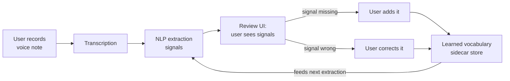
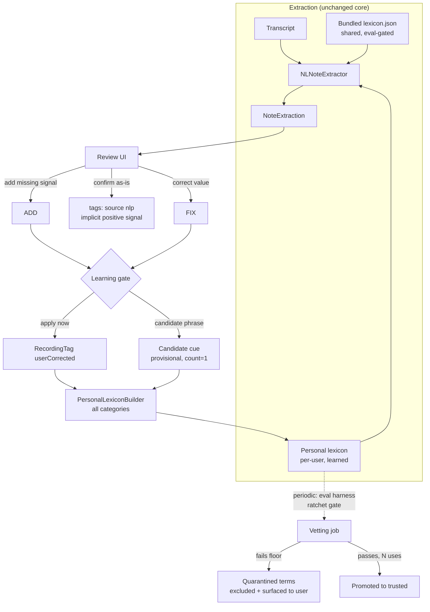

# Building a Self-Learning NLP Extractor

How to evolve the app's deterministic signal extractor into a human-in-the-loop system
that learns from user corrections. Grounded in published research (all sources cited
with URLs) and mapped onto the existing code.

**The target loop (as requested):**

**Bottom line up front (research verdict):** for "user corrects a missed extraction;
the app learns that term forever," the right mechanism is **not** an ML model — it is a
**persisted user lexicon that feeds the existing rule engine**, optionally generalized
with `NLEmbedding` similarity, plus a **suggest-and-confirm** UX and a **ratcheted
regression gate** so learning never silently degrades precision. ML (Create ML word
tagger, Foundation Models) plays supporting roles, not the memory role.

---

## 1. What the code already does today

The loop already exists in seed form:

| Piece | Code | Behavior today |
|---|---|---|
| Correction capture | `ExtractionReviewViewModel.confirm()` (`app-four/ViewModels/ExtractionReviewViewModel.swift:183-251`) | Any field the user edited in review is written as `RecordingTag(source: .userCorrected)` |
| Tag model | `app-four/Models/RecordingTag.swift` | `name`, `category` (mood/energy/focus/medication/emotions), `source` (nlp / user / userCorrected), optional `confidence` |
| Lexicon learning | `PersonalLexiconBuilder.build(from:)` (`app-four/Services/NoteExtraction/PersonalLexiconBuilder.swift`) | Builds a `PersonalLexicon` from `userCorrected` tags — **medications and emotions only** |
| Overlay merge | `LexiconData.toLexicon(personalOverlay:)` (`app-four/Services/NoteExtraction/LexiconData.swift:63-101`) | Personal meds/mood-words/emotions appended onto the bundled `lexicon.json` |
| Consumption | `NLNoteExtractor(lexicon:)` | Overlay terms are pre-tokenized like any bundled cue and match on the next extraction |

### The gaps (what "self-learning" still needs)

1. **Only two of ~15 signal categories learn.** Side effects, tasks, wins, overwhelm,
   exec dysfunction, rebound, appetite, sleep phrases, mood/energy/focus *phrases* —
   none accept learned cues. Mood/energy/focus corrections are explicitly discarded as
   "value changes, not new phrases" (`PersonalLexiconBuilder.swift:8-10`).
2. **Corrections learn the *value*, not the *phrase*.** If the user adds "meditation"
   as an activity, the system stores "meditation", but it never learns that the sentence
   pattern "did some breathwork" implies the activity. Names are learned; phrasing isn't.
3. **No learning from negation/not-taken corrections** (e.g. user untoggles "taken").
4. **No confidence or provenance tracking** on learned terms — every correction is
   trusted instantly and equally, forever.
5. **No guard against precision drift** — a bad learned term pollutes all future
   extractions silently. (The eval harness gates the *bundled* lexicon, not learned terms.)
6. **No UI for adding a *missing* signal the extractor never surfaced** for most
   categories beyond meds/emotions.

---

## 2. What the research says

### 2.1 Your design pattern has a name — and a track record

**Interactive Machine Learning (IML).** Fails & Olsen's originating IUI 2003 paper defines
exactly this loop: rapid *train → classify → user corrects → repeat*, and shows the UX
principle that matters most: **the loop must be fast and visible** — the user should see
the corrected extraction immediately, not on the next note.
([dl.acm.org/doi/10.1145/604045.604056](https://dl.acm.org/doi/10.1145/604045.604056))

**Memory-based teaching beats retraining.** The closest analog in the literature is
TeachMe (Dalvi Mishra et al., EMNLP 2022): users correct a system's beliefs; corrections go
into a **dynamic memory that conditions future inference — no model retraining**. Result:
+15% on hidden test, within 1% of the upper bound with feedback on **only 25% of examples**.
This validates the "learned-term sidecar next to a static lexicon" architecture and shows
you need surprisingly few corrections to capture most of the gain.
([arxiv.org/abs/2204.13074](https://arxiv.org/abs/2204.13074))

The teachable-extraction lineage (TREE, ICSC 2015) shows the same for information
extraction specifically: users teach extraction *patterns* interactively rather than
retraining from scratch.
([link.springer.com/chapter/10.1007/978-3-319-19581-0_23](https://link.springer.com/chapter/10.1007/978-3-319-19581-0_23))

### 2.2 Auto-add vs. ask-first: ask (cheaply)

Three independent research threads converge on the same answer:

- **Noisy oracles** (Settles' canonical active-learning survey, 2009): user labels can be
  wrong; use confirmation thresholds before trusting them.
  ([burrsettles.com/pub/settles.activelearning.pdf](https://burrsettles.com/pub/settles.activelearning.pdf))
- **Semantic drift** in set expansion (SetExpan, ECML-PKDD 2017): automatically grown
  vocabularies drift off-concept; validate candidates against observed contexts before
  promotion. ([arxiv.org/abs/1910.08192](https://arxiv.org/abs/1910.08192))
- **Expand → validate → re-expand** (SetExpander, Intel AI Lab, COLING 2018 demo): the
  deployed pattern is *system suggests candidates, user confirms, system re-expands* —
  not silent auto-addition.
  ([aclanthology.org/C18-2013/](https://aclanthology.org/C18-2013/))

Microsoft's **Guidelines for Human-AI Interaction** (Amershi et al., CHI 2019) add the UX
side: "enable efficient correction of errors," "make clear what the system can do,"
auto-apply when confident **with easy undo and disclosure**.
([dl.acm.org/doi/10.1145/3290605.3300233](https://dl.acm.org/doi/10.1145/3290605.3300233))

And "Power to the People" (Amershi et al., AI Magazine 2014) warns that **users' mental
models shape the labels they give** — the correction UI must ask for the *generalizable*
thing ("add this as a word for X"), not a one-off fix, or you learn junk.
([hcrlab.cs.washington.edu/publications/amershi2015aimag/](https://hcrlab.cs.washington.edu/publications/amershi2015aimag/))

**Design consequence:** a correction is applied immediately for the user (their note,
their truth) but promoted into *matching vocabulary* through a lightweight gate —
first use per term is provisional; repeated use or an explicit "remember this word"
confirms it.

### 2.3 Guarding precision: regression-test every vocabulary change

- spaCy/Explosion AI's pseudo-rehearsal writeup translates directly: when knowledge is
  added, re-verify old knowledge didn't break.
  ([explosion.ai/blog/pseudo-rehearsal-catastrophic-forgetting](https://explosion.ai/blog/pseudo-rehearsal-catastrophic-forgetting))
- You already own the mechanism: the eval harness with **ratcheted precision/recall
  floors** (`app-fourTests/Eval/ExtractionEvalTests.swift`). Run the learned lexicon
  against the same labeled `EvalSet` on every vocabulary change; a learned term that
  drops a floor is quarantined, not deployed.
- Snorkel's weak-supervision framing (Ratner et al., VLDB 2018) offers the principled
  version: treat each learned term as a noisy labeling function whose accuracy can be
  *estimated* from agreements/disagreements before it's trusted — and keep it per-user
  until proven. ([ar5iv.labs.arxiv.org/html/1711.10160](https://ar5iv.labs.arxiv.org/html/1711.10160))

### 2.4 Don't over-ask

HITL state-of-the-art reviews (Mosqueira-Rey et al., AI Review 2023; Wu et al., FGCS 2022)
are blunt about the cost side: user fatigue and label-quality degradation over time.
HITL pays off for high-value, edge-case, drifting vocabulary — which personal journaling
vocabulary is — but the system should learn **silently from confirmations** and only
interrupt when genuinely uncertain.
([link.springer.com/article/10.1007/s10462-022-10246-w](https://link.springer.com/article/10.1007/s10462-022-10246-w),
[arxiv.org/abs/2108.00941](https://arxiv.org/abs/2108.00941))

### 2.5 Cold start & few-shot

Each user's personal lexicon starts empty. SEE-Few (COLING 2022) and the ACM TIST few-shot
NER survey cover learning entity classes from a handful of examples — seed, expand,
**verify before trusting**. The practical takeaway: expect a user's first 5–10 corrections
to carry most of the personalization value (matches TeachMe's 25%-of-examples result), and
verify expansion candidates rather than accepting them raw.
([aclanthology.org/2022.coling-1.224/](https://aclanthology.org/2022.coling-1.224/),
[dl.acm.org/doi/10.1145/3609483](https://dl.acm.org/doi/10.1145/3609483))

### 2.6 Apple on-device technology options (researched separately)

| Technology | Source | Fit for "learn that term forever" |
|---|---|---|
| **User lexicon + rule engine** (current design) | — | **Best.** Deterministic, iOS 17+, learns forever by construction |
| `NLEmbedding` (word/sentence) | [developer.apple.com/documentation/naturallanguage/nlembedding](https://developer.apple.com/documentation/naturallanguage/nlembedding), [WWDC20-10657](https://developer.apple.com/videos/play/wwdc2020/10657/) | Recall booster: generalize a learned term to inflections/close variants at match time. Static similarity — doesn't learn; conservative per-signal thresholds needed (your code already documents iOS embedding noise, `Lexicon.swift:183-186`) |
| Create ML `MLWordTagger` / `MLTextClassifier` | [developer.apple.com/documentation/createml/mlwordtagger](https://developer.apple.com/documentation/createml/mlwordtagger), [WWDC19-428](https://developer.apple.com/videos/play/wwdc2019/428/), [WWDC19-430](https://developer.apple.com/videos/play/wwdc2019/430/) | Periodic **offline** consolidation: when enough corrections accumulate, retrain a proper tagger on a Mac and ship it. Cannot train on-device |
| Core ML `MLUpdateTask` (on-device personalization) | [developer.apple.com/documentation/coreml/mlupdatetask](https://developer.apple.com/documentation/coreml/mlupdatetask), [WWDC19-704](https://developer.apple.com/videos/play/wwdc2019/704/) | Real on-device fine-tuning, but only for k-NN/NN/pipeline classifiers — **no updatable token tagger**; poor fit for span extraction |
| Foundation Models framework (iOS 26) | [developer.apple.com/documentation/foundationmodels](https://developer.apple.com/documentation/foundationmodels), [WWDC25-286](https://developer.apple.com/videos/play/wwdc2025/286/), [tech report arXiv:2507.13575](https://arxiv.org/pdf/2507.13575v2) | **Fallback recall layer**: `@Generable` guided extraction over text the rules missed. Doesn't remember corrections either — you'd inject learned terms into the prompt, so the lexicon is still the memory. Caveats: ~4K token context, availability-gated, model changes with OS updates |

Independent confirmation from the literature search: **no Apple API supports incremental
on-device learning for NLTagger/Create ML text models** — which is itself an argument for
the lexicon-sidecar architecture.

---

## 3. Recommended architecture

### 3.1 Generalize the personal lexicon to every learnable category

Extend `PersonalLexicon` (`LexiconData.swift:107-117`) beyond meds/emotions:

| New overlay field | Feeds extractor list | Learned from |
|---|---|---|
| `medications` (exists) | `lexicon.medications` | added med names |
| `emotions` (exists) | `lexicon.emotions` | added emotions |
| `moodSpecific` (exists) | mood cue→label entries | "when I say X I mean mood Y" |
| `energyPhrases` / `focusPhrases` | energy/focus level cue lists | phrase + chosen level |
| `activityKeywords` | per-category keyword lists | added activities |
| `sideEffectCues`, `reboundTerms`, `appetiteLoss/Return`, … | topic cue lists | phrase marked as that signal |

This is a mechanical change: every cue list already flows through the same
`CachedCues` pre-tokenization at init — overlay entries ride the same path.

### 3.2 Learn phrases, not just values

When the user adds a missing signal, capture **two** things:

1. the canonical value (e.g. activity "climbing"), and
2. the **surface phrase from their sentence** they tapped on (e.g. "hit the climbing gym").

Store the surface phrase as the cue; normalize to the value as the label. This is the
difference between the current name-learning and genuine vocabulary learning, and it's
what the IML literature means by giving the system *generalizable* corrections
(Amershi 2014, §2.2). The review UI should default the cue field to the tapped span and
let the user trim it.

### 3.3 Provisional → trusted promotion (the learning gate)

Per learned term, persist: `term`, `category`, `label`, `source` (correction / suggestion),
`useCount`, `firstSeen`, `status` (provisional / trusted / quarantined).

| Rule | Behavior |
|---|---|
| Correction applies immediately | The user's own note always reflects their truth |
| New cue starts **provisional** | Matches for this user only, never globally |
| Promoted after N (e.g. 3) distinct notes matched without user removing the signal | Silent confirmations count as positive labels (§2.4 — don't ask) |
| User deletes an auto-extracted signal that came from a learned cue | Decrement / quarantine the cue — negative feedback is the strongest signal |
| Bundled (global) lexicon unchanged | Per-user only; global promotion happens offline via the eval harness |

### 3.4 Precision guardrails

- **Eval ratchet on the overlay**: a test target that runs `EvalSet` with
  bundled-lexicon + accumulated overlay; floors can only go up. Run in CI before any
  overlay-to-bundle promotion.
- **Per-term provenance**: every learned cue carries its origin note id, so a bad term
  can be traced and quarantined with one tap ("why did this match?").
- **Easy undo** (CHI guidelines): the review screen shows which signals came from
  *learned* vocabulary vs. the base lexicon, with a "forget this word" action.
- **Negation safety**: learned cues go through the exact same `isNegatedBefore` /
  flip machinery as bundled cues — no special path.

### 3.5 Optional recall boosters (later phases)

- **NLEmbedding-assisted suggestion**: when the user adds a term, embed it and surface
  "did you also mean X, Y?" from near neighbors — the SetExpander expand/validate loop
  (§2.2). Suggestions only; never auto-added. Keep thresholds conservative — your own
  code documents iOS embedding distance noise (`Lexicon.swift:183-186`).
- **Foundation Models fallback (iOS 26)**: for notes where rule extraction found little,
  a guided `@Generable` pass with the *learned lexicon injected into the prompt* as
  candidate vocabulary. The lexicon remains the memory; the LLM is only a parser.
  Gate on `SystemLanguageModel.availability`; keep the deterministic extractor as the
  primary path and the eval harness as arbiter between them.
- **Periodic consolidation**: when a user's overlay stabilizes, an `MLWordTagger`
  trained offline (Create ML on macOS) on bundled examples + accumulated corrections can
  be evaluated against the rule engine — adopt only if it beats the floors.

---

## 4. Phased implementation path

| Phase | Scope | Exit criteria |
|---|---|---|
| **1. Generalize the overlay** | Extend `PersonalLexicon` to all learnable categories; `PersonalLexiconBuilder` collects phrases (not just names) from `userCorrected` tags; store tapped surface span in `RecordingTag` | User adds "breathwork" as activity once; next note saying "breathwork" extracts it |
| **2. Learning gate + provenance** | Provisional/trusted/quarantined status, use counts, negative feedback from deletions, "forget this word" in review UI | Learned terms visibly badged in review; deletion demotes; 3 confirmations promote |
| **3. Precision guardrails** | Overlay-aware eval tests (ratcheted floors); quarantine job; per-term trace to origin note | A deliberately bad learned term is caught by the eval run and quarantined |
| **4. Suggestion loop (optional)** | NLEmbedding neighbor suggestions on correction, confirm-to-add | Suggestions shown, nothing auto-added |
| **5. Foundation Models fallback (optional, iOS 26)** | Guided extraction with learned terms in prompt for low-yield notes; A/B against floors | Beats or matches rule-only recall on `EvalSet` without precision loss |

Phases 1–3 are the self-learning system the research endorses. Phases 4–5 are recall
boosters that depend on, but do not replace, the lexicon memory.

---

## 5. Source list

**Human-in-the-loop & interactive ML**
1. Settles, *Active Learning Literature Survey*, 2009 — https://burrsettles.com/pub/settles.activelearning.pdf
2. Wu et al., *A Survey of Human-in-the-Loop for ML*, FGCS 2022 — https://arxiv.org/abs/2108.00941
3. Mosqueira-Rey et al., *Human-in-the-loop ML: a state of the art*, AI Review 2023 — https://link.springer.com/article/10.1007/s10462-022-10246-w
4. Amershi et al., *Power to the People*, AI Magazine 2014 — https://hcrlab.cs.washington.edu/publications/amershi2015aimag/
5. Fails & Olsen, *Interactive Machine Learning*, IUI 2003 — https://dl.acm.org/doi/10.1145/604045.604056
6. Amershi et al., *Guidelines for Human-AI Interaction*, CHI 2019 — https://dl.acm.org/doi/10.1145/3290605.3300233
7. Dalvi Mishra et al., *TeachMe: Dynamic Memory of User Feedback*, EMNLP 2022 — https://arxiv.org/abs/2204.13074
8. *TREE: Teachable Relation and Event Extraction*, ICSC 2015 — https://link.springer.com/chapter/10.1007/978-3-319-19581-0_23

**Weak supervision & lexicon growth**
9. Ratner et al., *Snorkel*, VLDB 2018 — https://ar5iv.labs.arxiv.org/html/1711.10160
10. Snorkel AI, *Essential Guide to Weak Supervision* — https://snorkel.ai/data-centric-ai/weak-supervision/
11. Shen et al., *SetExpan*, ECML-PKDD 2017 — https://arxiv.org/abs/1910.08192
12. Mamou et al. (Intel AI Lab), *SetExpander*, COLING 2018 — https://aclanthology.org/C18-2013/
13. Yang & Katiyar, *SEE-Few*, COLING 2022 — https://aclanthology.org/2022.coling-1.224/
14. *Few-shot NER: Definition, Taxonomy and Research Directions*, ACM TIST 2023 — https://dl.acm.org/doi/10.1145/3609483
15. Explosion AI, *Pseudo-rehearsal: catastrophic forgetting for NLP*, 2017 — https://explosion.ai/blog/pseudo-rehearsal-catastrophic-forgetting

**Apple on-device NLP**
16. NLEmbedding — https://developer.apple.com/documentation/naturallanguage/nlembedding
17. WWDC20-10657, *Make apps smarter with Natural Language* — https://developer.apple.com/videos/play/wwdc2020/10657/
18. MLWordTagger — https://developer.apple.com/documentation/createml/mlwordtagger
19. WWDC19-428, *Training Text Classifiers in Create ML* — https://developer.apple.com/videos/play/wwdc2019/428/
20. WWDC19-430, *Introducing the Create ML App* — https://developer.apple.com/videos/play/wwdc2019/430/
21. MLUpdateTask — https://developer.apple.com/documentation/coreml/mlupdatetask
22. WWDC19-704, *Core ML 3 Framework* (on-device personalization) — https://developer.apple.com/videos/play/wwdc2019/704/
23. Foundation Models framework — https://developer.apple.com/documentation/foundationmodels
24. WWDC25-286, *Meet the Foundation Models framework* — https://developer.apple.com/videos/play/wwdc2025/286/
25. WWDC25-301, *Deep dive into the Foundation Models framework* — https://developer.apple.com/videos/play/wwdc2025/301/
26. Apple Foundation Language Models tech report — https://arxiv.org/pdf/2507.13575v2
27. Apple ML Research, *Learning with Privacy at Scale* (differential privacy) — https://machinelearning.apple.com/research/learning-with-privacy-at-scale

**Related code references**
- Current extractor reference: `docs/engineering/nlp-extraction.md`
- Correction capture: `app-four/ViewModels/ExtractionReviewViewModel.swift`
- Learning seed: `app-four/Services/NoteExtraction/PersonalLexiconBuilder.swift`, `LexiconData.swift`
- Eval harness: `app-fourTests/Eval/ExtractionEvalTests.swift`
