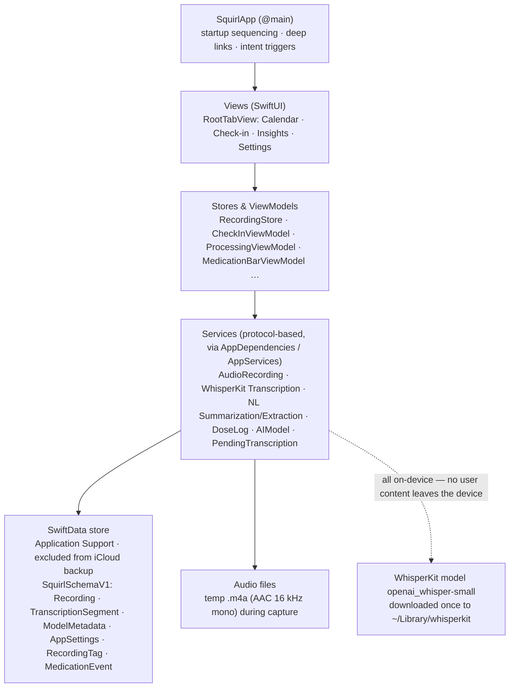

<!-- Created: 2026-07-27 15:10 (WEST) · Updated: 2026-07-27 15:10 (WEST) -->
# 01 — Overview

## Purpose

Squirl is an **on-device, privacy-first iOS check-in journal**. The user voice-logs (or types) a daily check-in in under a minute; the app transcribes the audio and extracts structured signals — mood, energy, focus, sleep, medications, side effects, emotions — **entirely on-device**, then surfaces personal patterns over time.

There is **no account, no server, and no cloud by default**. The north star is **effortless**: in and out in under a minute, with the app "always slightly calmer than you." The first three seconds of any session should read as *relief, then permission*.

This file establishes the product framing every other FSD area depends on: who the app serves, which principles act as hard functional constraints, what the product deliberately refuses to do, the platform baseline, the high-level architecture, and the domain vocabulary.

## Scope

- **In scope:** product purpose and positioning, target users and personas, design principles as functional constraints, anti-goals, platform support, high-level architecture, glossary.
- **Out of scope:** per-area functional requirements (see the area files listed in [README.md](README.md)); visual design tokens (source of truth is `DESIGN.md`).

## Target users & personas

**Primary audience:** adults (18+) with ADHD who want to track mood, energy, focus, sleep, and medications without typing forms or sacrificing privacy. The ADHD audience is a **functional constraint, not flavor**: low cognitive load, minimal friction, no overwhelm, fast and clear reward.

Personas (from `PRODUCT.md`):

- **Alex — medicated daily checker.** Checks in every day; medication timing and effect tracking matter most.
- **Jordan — streak-burned sporadic tracker.** Has deleted tracker apps over shame mechanics; needs a journal that never punishes gaps.
- **Sam — privacy-absolutist paper journaler.** Will not use anything that sends personal audio or health data off the device.

**Secondary:** anyone wanting a voice-first, privacy-first daily check-in journal.

## Design principles as functional constraints

The five design principles in `PRODUCT.md` are not aspirations; they are binding constraints on functional behavior throughout this FSD:

1. **Effortless over complete** — one primary action per screen, sub-minute capture, progressive disclosure. Concretely: the Check-in tab has a single dominant action ("Speak check-in"), and capture requires no forms.
2. **Non-judgmental by construction** — no streaks, no nags, no faces. The reward is "I said it and it's captured." Concretely: the saved state shows "Captured." once and offers no score, no streak counter, no celebration loop.
3. **Privacy by architecture, not policy** — on-device transcription (WhisperKit), on-device extraction (NaturalLanguage framework), on-device storage; the SwiftData store directory is excluded from iCloud backup (`AppModelContainer.swift:28-30`). The design never invites data-sharing patterns.
4. **Deterministic over probabilistic · auditable over opaque · instant over eventual** — predictable, explainable behavior in UX. Concretely: extraction results are user-editable (the "Edit check-in" sheet) and corrections are persisted as provenance tags (`RecordingTag(source: .userCorrected)`); failure surfaces state exactly what happened.
5. **Color is never the only cue** — every signal level is also encoded by glyph shape + fill (colorblind- and grayscale-safe). Signals use distinct shapes (sprout / lightning bolt / aperture / bed / capsule), never emoji faces.

## Anti-goals

Explicit non-features (from `PRODUCT.md` / `DESIGN.md` "Product Posture (non-negotiable)"):

- **No streaks, no badges, no gamification, no confetti.** A broken streak is a shame spiral for ADHD users and the #1 reason these apps get deleted.
- **Medication never nags.** No red "you're late" alarms; a worn-off dose just goes quiet (the medication bar fills empty→full over the dose and fades out silently).
- **No cloud, no account, no server** by default; nothing that undermines the on-device privacy promise (including surveillance imagery).
- **No emoji-face mood rating** — faces impose self-judgment; abstract growth glyphs are lower-stakes.
- **No blue/purple "calm" category palette**; no pure-white or pure-black surfaces.

## Platform support

- **Platform:** iOS, native SwiftUI + SwiftData, targeting iOS 26 (Liquid Glass era) per `DESIGN.md`.
- **On-device ML:** WhisperKit (`openai_whisper-small`) for transcription; Apple NaturalLanguage framework for signal extraction. Both run locally; no network call carries user content.
- **Persistence:** SwiftData, schema `SquirlSchemaV1` (`Schema.Version(1, 0, 0)`), stored under Application Support and excluded from iCloud backup. See [09-data-model.md](09-data-model.md).
- **Local packages:** `SquirlCore`, `SquirlDesignSystem`, `SquirlSignals` under `Packages/`. See [10-architecture-and-services.md](10-architecture-and-services.md).
- **Accessibility floor:** WCAG 2.1/2.2 AA — contrast ≥ 4.5:1 body / ≥ 3:1 large+UI, touch targets ≥ 44×44 pt, VoiceOver labels on all controls, Dynamic Type AX1–AX5, Reduce Motion fallbacks. See [11-nonfunctional.md](11-nonfunctional.md).

## High-level architecture

Key architectural facts:

- **Capture → background pipeline.** Saving a recording immediately shows the "Captured." state; transcription and extraction run silently afterward and land in Calendar/Insights. See [03-check-in-capture.md](03-check-in-capture.md) and [04-processing-and-extraction.md](04-processing-and-extraction.md).
- **Single-inference transcription.** The WhisperKit engine never runs two inferences at once; a new recording's transcription chains after any prior one.
- **Deferred transcription queue.** Recordings captured before the model is installed are persisted with status `pendingTranscription` and drained later (launch / foreground / download completion) through the identical pipeline.
- **Dependency injection** is centralized in `AppDependencies` / `AppServices` and injected via the SwiftUI environment. See [10-architecture-and-services.md](10-architecture-and-services.md).
- **Entry points** beyond the tab bar: the `whispernotes://checkin` deep link and two App Intents (both dormant in 1.0), all routed through one `AppIntentRouter` choke point. See [02-navigation-and-shell.md](02-navigation-and-shell.md).

## Glossary

| Term | Definition |
|---|---|
| **Check-in** | A single journal entry: a voice recording (≤ 480 s) or a typed note, plus the signals extracted from or explicitly set on it. |
| **Signals** | The structured dimensions extracted from a check-in: **mood**, **energy**, **focus** (1–5 ordinal scales), **sleep**, **medications**, **side effects**, **emotions**. |
| **Signal glyphs** | The shape+hue+fill encodings per signal: sprout (mood), lightning bolt (energy), aperture (focus), bed (sleep), capsule (medication). Level is encoded triple-redundantly (shape, hue, fill). |
| **Capture stage** | The shared Check-in screen container for the idle/recording/paused/processing states, keeping the crescent anchored across state changes. |
| **Crescent / CrescentRing** | The decorative breathing (idle) / rotating (recording) ring at the center of the Check-in tab; collapses to static under Reduce Motion. |
| **Nudge prompts** | The five rotating question cards shown while recording ("How's your mood?" etc.) at a user-configurable pace (Relaxed 10 s / Brisk 6 s). |
| **Day card** | The per-day summary surface in the Calendar library aggregating that day's check-ins and medication events. See [05-library-and-history.md](05-library-and-history.md). |
| **Dose guard** | The medication safety rule that refuses to log a second dose while an earlier dose is still active. See [07-medications.md](07-medications.md). |
| **Medication bar** | The floating overlay showing an active dose, filling from empty (just taken) to full (worn off) over the dose duration; never alarms. |
| **Extraction review / "Edit check-in"** | The modal sheet for correcting extracted signals; saving writes a `userCorrected` provenance tag that trains the personal lexicon. |
| **Personal lexicon** | The user-specific vocabulary overlay built from corrections, layered over the bundled `lexicon.json` for signal extraction. |
| **Pending transcription queue** | The backlog of recordings saved before the Whisper model was installed, drained automatically once the model is ready. |
| **Mock mode** | DEBUG-only populated-timeline mode (`debugMockMode` UserDefaults key) seeding 10 days of dummy data; always cleared in release builds. |
| **Ephemeral mode** | Degraded launch state where the on-disk store could not be opened and the app runs on an in-memory container (`isEphemeral = true`); writes do not survive relaunch. |
| **Quarantine** | The release-mode recovery action that renames (never deletes) an unopenable store trio into `Quarantine/<ISO8601-stamp>/` and retries a fresh open. |
| **"Paper & Pollen" / "New Look"** | The two visual languages in the design system; New Look (spec 033) is the app-wide language on `main`. Token-level details live in `DESIGN.md`. |

## Source references

- `PRODUCT.md` — users, personas, product purpose, anti-references, design principles, accessibility floor
- `DESIGN.md:84-88` — product posture (non-negotiable): no streaks, no med nags, glyphs not faces, privacy-first
- `DESIGN.md:71` — four tabs: Calendar · Check-in · Insights · Settings
- `app-four/App/SquirlSchema.swift:10-22` — schema V1, model list
- `app-four/App/AppModelContainer.swift:28-30` — store excluded from iCloud backup
- `app-four/Services/WhisperKit/WhisperKitTranscriptionService.swift:11` — model `openai_whisper-small`
- `app-four/Utils/Constants.swift:14-19` — model download base `~/Library/whisperkit`
- `build/fsd-notes/01-shell-capture.md` §1–2, §15 — startup, container, constants (basis for architecture facts)
