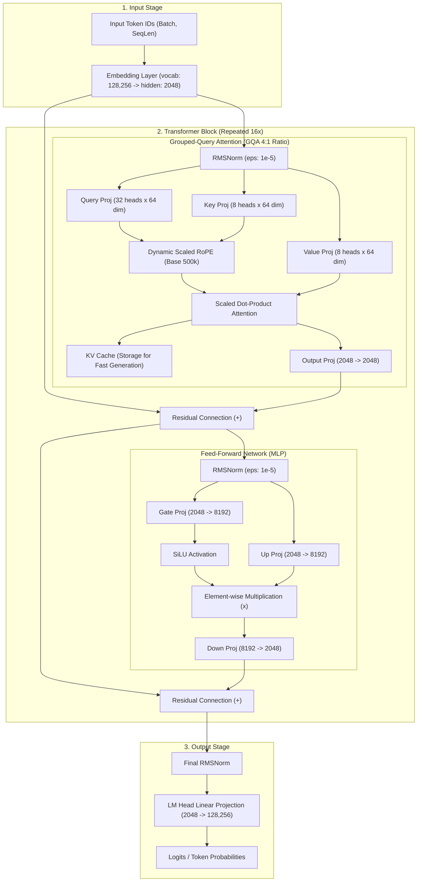

# Llama 3.2 1B, MLX Swift, Context Engineering & Qwen 2.5 Architecture Guide

## Overview

This comprehensive technical guide compiles all architectural explanations, input management patterns, system prompt engineering practices, iOS execution comparisons, and model swapping documentation for the **Llama 3.2 1B** model integrated into this application via Apple's **MLX Swift** framework.

---

## Table of Contents
1. [Llama 3.2 1B Integration in This Project](#1-llama-32-1b-integration-in-this-project)
2. [Llama 3.2 1B Model Architecture & Diagram](#2-llama-32-1b-model-architecture--diagram)
3. [Input Capabilities, Hidden System Prompts, User Profiles & Memory](#3-input-capabilities-hidden-system-prompts-user-profiles--memory)
4. [Llama 3 Special Tokens & Automatic Tokenizer Injection](#4-llama-3-special-tokens--automatic-tokenizer-injection)
5. [Architectural Comparison: Llama 3.2 1B vs. Qwen 2.5 1.5B & 0.5B](#5-architectural-comparison-llama-32-1b-vs-qwen-25-15b--05b)
6. [Apple MLX Swift vs. Core ML on iOS / iPhone](#6-apple-mlx-swift-vs-core-ml-on-ios--iphone)
7. [Plug-and-Play Model Swapping in Code (Llama → Qwen / DeepSeek / Gemma)](#7-plug-and-play-model-swapping-in-code-llama--qwen--deepseek--gemma)
8. [Master Technical Terms & Learning Deep-Dive](#8-master-technical-terms--learning-deep-dive)

---

## 1. Llama 3.2 1B Integration in This Project

### Model Specs & Execution Framework
* **Model Checkpoint**: `mlx-community/Llama-3.2-1B-Instruct-4bit` (configured via `LLMRegistry.llama3_2_1B_4bit` in [`LLMModelFactory.swift`](file:///Users/caesargrey/Projects/app-four-llama/Packages/mlx-swift-examples/Libraries/MLXLLM/LLMModelFactory.swift#L243-L246)).
* **Execution Framework**: Apple's **MLX Swift** framework (`MLXLLM` & `MLXLMCommon`) compiled for Metal performance shaders on Apple Silicon GPUs.
* **Quantization**: 4-bit weights quantization (INT4), providing a low memory footprint (~615MB VRAM) and fast on-device inference.
* **Primary Service**: Managed in [`MLXJournalService.swift`](file:///Users/caesargrey/Projects/app-four-llama/app-four/Services/MLXJournalService.swift).
* **Application Goal**: Extracting structured clinical signals (mood, energy, focus, sleep, medications, side effects, topics) from audio journal transcriptions.

### Input Management Pipeline

```
┌────────────────────────────────────────────────────────────────────────┐
│ System Prompt (Hidden Prompt)                                          │
│ - "You are an expert clinical extractor..."                            │
│ - Allowed signal labels, medication lists, few-shot JSON examples      │
├────────────────────────────────────────────────────────────────────────┤
│ User Message                                                           │
│ - "Extract signals from this transcript: [Voice Transcript Text]"       │
└────────────────────────────────────────────────────────────────────────┘
                                    │
                                    ▼
                      ChatSession (MLX Engine)
                                    │
                                    ▼
                         Llama-3.2-1B-Instruct
```

1. **System Prompt Construction**: [`MLXPromptBuilder.swift`](file:///Users/caesargrey/Projects/app-four-llama/app-four/Services/MLXPromptBuilder.swift#L5-L79) dynamically constructs a hidden system prompt containing allowed signal labels, medication dictionaries, slang terms, and few-shot JSON examples.
2. **User Message Builder**: Wraps the raw transcript string into `"Extract signals from this transcript:\n\(transcript)"`.
3. **Actor-Based Session Execution**: [`MLXJournalService.swift`](file:///Users/caesargrey/Projects/app-four-llama/app-four/Services/MLXJournalService.swift#L78-L104) manages model loading through a thread-safe `ModelHolder` actor, running `ChatSession` with a low temperature ($T = 0.1$).
4. **Validation & Extraction Recovery**: The resulting JSON is parsed using a 3-stage fallback (`ExtractionValidator`) and validated against domain enums and lexicon allowlists.

---

## 2. Llama 3.2 1B Model Architecture & Diagram

The model implementation resides in [`Llama.swift`](file:///Users/caesargrey/Projects/app-four-llama/Packages/mlx-swift-examples/Libraries/MLXLLM/Models/Llama.swift). It is a **decoder-only Transformer** with Grouped-Query Attention (GQA), Rotary Position Embeddings (RoPE), RMSNorm, and SwiGLU activations.



---

## 3. Input Capabilities, Hidden System Prompts, User Profiles & Memory

### What Can You Include in a System Prompt?

In modern AI Context Engineering, the system prompt acts as a **Dynamic State Bridge** between your database and the LLM's attention mechanism:

```
┌────────────────────────────────────────────────────────────────────────────────┐
│ 1. SYSTEM ROLE & PERSONA                                                       │
│    "You are Squirl AI, a clinical extraction and journal summary assistant..."    │
├────────────────────────────────────────────────────────────────────────────────┤
│ 2. REAL-TIME ENVIRONMENT & TEMPORAL CONTEXT                                    │
│    Date: Thursday, Aug 13, 2026 | Time: 6:30 PM | Session: Evening Check-in    │
├────────────────────────────────────────────────────────────────────────────────┤
│ 3. USER PROFILE STATE (<user_profile>)                                         │
│    Age, baseline energy, preferred response tone, primary health goals         │
├────────────────────────────────────────────────────────────────────────────────┤
│ 4. ACTIVE MEDICAL CONTEXT (<active_medications>)                               │
│    Current prescriptions, dosages, administration time (AM/PM), side effects   │
├────────────────────────────────────────────────────────────────────────────────┤
│ 5. RECENT EPISODIC MEMORY (<recent_memory>)                                    │
│    Yesterday's summary, 3-day mood trend, unresolved tasks from last session   │
├────────────────────────────────────────────────────────────────────────────────┤
│ 6. DOMAIN KNOWLEDGE & LEXICON (<lexicon>)                                      │
│    Allowed JSON schema, allowed enum tags, custom slang dictionary             │
├────────────────────────────────────────────────────────────────────────────────┤
│ 7. OUTPUT FORMAT & SAFETY CONSTRAINTS                                          │
│    "Return ONLY raw JSON. No markdown backticks. If data missing, use null."   │
└────────────────────────────────────────────────────────────────────────────────┘
```

### Production Swift Example with XML Delimiters

```swift
import Foundation

struct UserProfile {
    let name: String
    let baselineEnergy: String
    let communicationTone: String
}

struct Medication {
    let name: String
    let dose: String
    let schedule: String // e.g. "Morning"
}

struct PastSessionMemory {
    let lastDate: String
    let lastSummary: String
    let lastMood: String
    let unhandledSideEffects: [String]
}

enum AdvancedPromptBuilder {
    
    static func buildDynamicSystemPrompt(
        profile: UserProfile,
        medications: [Medication],
        memory: PastSessionMemory?,
        lexicon: Lexicon
    ) -> String {
        
        let currentDate = DateFormatter.localizedString(from: Date(), dateStyle: .full, timeStyle: .short)
        let medList = medications.map { "- \($0.name) (\($0.dose), \($0.schedule))" }.joined(separator: "\n")
        
        var memorySection = "No previous session recorded."
        if let mem = memory {
            memorySection = """
            - Last Session Date: \(mem.lastDate)
            - Last Logged Mood: \(mem.lastMood)
            - Summary: "\(mem.lastSummary)"
            - Tracked Side Effects: \(mem.unhandledSideEffects.joined(separator: ", "))
            """
        }
        
        return """
        You are an expert clinical signal extraction engine for ADHD journal notes.
        
        <environment>
        Current Time: \(currentDate)
        </environment>

        <user_profile>
        Name: \(profile.name)
        Baseline Energy: \(profile.baselineEnergy)
        Preferred Tone: \(profile.communicationTone)
        </user_profile>

        <active_medications>
        \(medList.isEmpty ? "None listed" : medList)
        </active_medications>

        <recent_memory>
        \(memorySection)
        </recent_memory>

        <output_schema>
        Return ONLY a single valid JSON object. Do NOT wrap in ```json ``` code fences.
        If data is missing, set value to null.
        </output_schema>
        """
    }
}
```

---

## 4. Llama 3 Special Tokens & Automatic Tokenizer Injection

### Meta Llama 3 Control Tokens Table

| Special Token | Vocabulary Token ID | Purpose |
| :--- | :---: | :--- |
| `<|begin_of_text|>` | `128000` | Marks the absolute beginning of prompt execution. |
| `<|start_header_id|>` | `128006` | Marks the opening boundary of a role header (`system`, `user`, `assistant`). |
| `<|end_header_id|>` | `128007` | Marks the closing boundary of a role header. |
| `<|eot_id|>` | `128009` | **End of Turn**: Signals that a role turn is finished. |
| `<|end_of_text|>` | `128001` | Marks the end of generation. |

### How MLX Injects Special Tokens Automatically

When you write `ChatSession(modelContainer, instructions: systemPrompt).respond(to: userMessage)`:

1. **Role Array Packaging**: Swift creates `[["role": "system", "content": systemPrompt], ["role": "user", "content": userMessage]]`.
2. **Jinja2 Template Fetching**: MLX reads the model's bundled `tokenizer_config.json` Jinja2 template.
3. **`tokenizer.applyChatTemplate()`**: Called in [`LLMModelFactory.swift:L424`](file:///Users/caesargrey/Projects/app-four-llama/Packages/mlx-swift-examples/Libraries/MLXLLM/LLMModelFactory.swift#L424) to transform roles into atomic integer token IDs:

```text
[128000]                                       <-- <|begin_of_text|>
[128006] 9125 [128007] \n\n                    <-- <|start_header_id|> system <|end_header_id|>
[You, are, an, expert, clinical, extractor...] <-- System prompt body
[128009]                                       <-- <|eot_id|> (End of System Turn)
[128006] 882 [128007] \n\n                     <-- <|start_header_id|> user <|end_header_id|>
[Extract, signals, from, transcript...]        <-- User transcript
[128009]                                       <-- <|eot_id|> (End of User Turn)
[128006] 78191 [128007] \n\n                   <-- <|start_header_id|> assistant <|end_header_id|>
```

---

## 5. Architectural Comparison: Llama 3.2 1B vs. Qwen 2.5 1.5B & 0.5B

### Specification Comparison Matrix

| Architectural Feature | Llama 3.2 1B | Qwen 2.5 1.5B | Qwen 2.5 0.5B |
| :--- | :--- | :--- | :--- |
| **Total Parameters** | **~1.23 Billion** | **~1.54 Billion** | **~0.49 Billion** |
| **Hidden Layers (`num_hidden_layers`)** | **16** (Shallower) | **28** (Deeper) | **24** |
| **Hidden Dimension (`hidden_size`)** | **2048** (Wider) | **1536** (Narrower) | **896** |
| **Attention Heads (`num_attention_heads`)** | **32** | **12** | **14** |
| **Key-Value Heads (`num_key_value_heads`)** | **8** (GQA 4:1) | **2** (GQA 6:1) | **2** (GQA 7:1) |
| **Head Dimension (`head_dim`)** | **64** | **128** | **64** |
| **Intermediate Size (MLP)** | **8192** | **8960** | **4864** |
| **Vocabulary Size** | **128,256** | **151,936** | **151,936** |
| **Context Length (Native)** | **128,000 tokens (128K)** | **32,768 tokens (32K)** | **32,768 tokens (32K)** |
| **RoPE Base Frequency** | `500,000` (Llama 3 scaled) | `1,000,000` | `1,000,000` |
| **Activation Function** | SwiGLU | SwiGLU | SwiGLU |
| **Training Dataset Size** | **9 Trillion** tokens | **18 Trillion** tokens | **18 Trillion** tokens |

---

## 6. Apple MLX Swift vs. Core ML on iOS / iPhone

| Dimension | 🚀 Apple MLX (MLX Swift) | 🍏 Core ML |
| :--- | :--- | :--- |
| **What it is** | Open-source C++/Swift framework built by Apple Research | System-level framework built directly into iOS/macOS (`import CoreML`) |
| **Primary Hardware Used** | **Metal GPU + CPU** (Unified Memory Architecture) | **Apple Neural Engine (ANE)** + GPU + CPU |
| **Model Formats Used** | Hugging Face weights directly (`safetensors`, PyTorch converted) | Apple compiled `.mlpackage` / `.mlmodel` formats |
| **On-Device Fine-Tuning** | **Yes** (Supports LoRA / QLoRA training on device) | ❌ **No** (Inference only) |
| **LLM KV Caching & Loops** | **Native & Dynamic** ([`Llama.swift`](file:///Users/caesargrey/Projects/app-four-llama/Packages/mlx-swift-examples/Libraries/MLXLLM/Models/Llama.swift)) | Rigid (Requires fixed static tensor shapes) |
| **Adding New Open Models** | **Instant** (Load weights straight from Hugging Face `mlx-community`) | Requires converting PyTorch models via `coremltools` Python scripts |
| **Simulator Support** | ⚠️ Logic runs on Sim; GPU inference requires physical device / Mac host | Full Simulator support (via CPU fallback) |

---

## 7. Plug-and-Play Model Swapping in Code (Llama → Qwen / DeepSeek / Gemma)

Swapping models in this application requires updating **a single line of code** in [`MLXJournalService.swift:L90`](file:///Users/caesargrey/Projects/app-four-llama/app-four/Services/MLXJournalService.swift#L90):

```swift
// ─── SWAP TO QWEN 2.5 1.5B ─────────────────────────────────
let config = LLMRegistry.qwen2_5_1_5b

// ─── SWAP TO DEEPSEEK R1 4-BIT ──────────────────────────────
let config = LLMRegistry.deepseek_r1_4bit

// ─── SWAP TO GEMMA 2 2B 4-BIT ──────────────────────────────
let config = ModelConfiguration(id: "mlx-community/gemma-2-2b-it-4bit")
```

Because `LLMModelFactory` uses a polymorphic factory pattern ([`LLMModelFactory.swift:L41`](file:///Users/caesargrey/Projects/app-four-llama/Packages/mlx-swift-examples/Libraries/MLXLLM/LLMModelFactory.swift#L41)), MLX automatically selects `Qwen2Model` or `LlamaModel` and adapts tokenizer ChatML special tokens dynamically.

---

## 8. Master Technical Terms & Learning Deep-Dive

### 1. On-Device LLM Inference & Unified Memory Architecture (UMA)
* **Concept**: Running Large Language Model inference locally on Apple Silicon GPUs rather than sending user data over HTTP to cloud APIs.
* **Hardware Advantage**: Apple Silicon's UMA shares LPDDR5 RAM between CPU, GPU, and Neural Engine without PCIe bus data-transfer overhead.

### 2. INT4 Quantization Math
A floating-point weight $w \in \mathbb{R}$ is mapped to a 4-bit integer $q \in [-8, 7]$ using scale factor $S$ and zero-point $Z$:
$$w \approx S \times (q - Z)$$
Reduces 1.23B parameter VRAM footprint from $2.46\text{ GB}$ (FP16) down to $\approx 615\text{ MB}$ (INT4).

### 3. Softmax Temperature Sampling ($T$)
$$P(x_i) = \frac{\exp(z_i / T)}{\sum_{j=1}^{V} \exp(z_j / T)}$$
Low temperature ($T = 0.1$) sharpens probabilities for deterministic JSON extraction.

### 4. RMSNorm (Root Mean Square Normalization)
$$\text{RMSNorm}(x) = \frac{x}{\text{RMS}(x)} \odot \gamma, \quad \text{where } \text{RMS}(x) = \sqrt{\frac{1}{d} \sum_{i=1}^{d} x_i^2 + \epsilon}$$
Eliminates mean-centering, speeding up GPU kernels by $7\text{--}10\%$.

### 5. Grouped-Query Attention (GQA)
Query heads ($H_q = 32$) are split into groups sharing Key/Value heads ($H_{kv} = 8$), reducing KV Cache memory footprint by $75\%$ vs Multi-Head Attention.

### 6. Rotary Position Embeddings (RoPE)
$$R_{\Theta, m}^2 \begin{pmatrix} x_1 \\ x_2 \end{pmatrix} = \begin{pmatrix} \cos(m\theta_i) & -\sin(m\theta_i) \\ \sin(m\theta_i) & \cos(m\theta_i) \end{pmatrix} \begin{pmatrix} x_1 \\ x_2 \end{pmatrix}$$
Encodes relative token distances $(m - n)$ into Query and Key projections.

### 7. SwiGLU Activation Function
$$\text{SwiGLU}(x) = \text{SiLU}(x W_{\text{gate}}) \odot (x W_{\text{up}})$$
Replaces ReLU/GELU to eliminate dead neurons and improve model expressiveness.

### 8. KV Cache Memory Mathematical Calculation
$$\text{KV Cache Size} = 2 \times N_{\text{layers}} \times H_{kv} \times d_{\text{head}} \times L \times \text{Bytes}$$
For 1,000 context tokens:
* **Llama 3.2 1B**: $2 \times 16 \times 8 \times 64 \times 1000 \times 2 = 32.77\text{ MB}$.
* **Qwen 2.5 1.5B**: $2 \times 28 \times 2 \times 128 \times 1000 \times 2 = 28.67\text{ MB}$.
