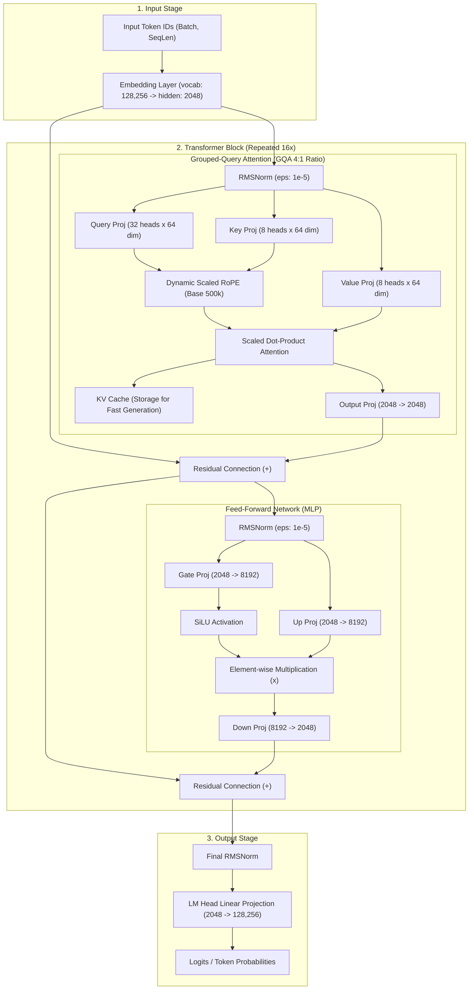

# Llama 3.2 1B Model Architecture, Integration & Qwen 2.5 Comparison

## Overview

This document provides a comprehensive technical overview of the **Llama 3.2 1B** model integrated into this application. It explains how the model works on Apple Silicon, its input management pipeline, its internal transformer architecture, and an in-depth comparison against equivalent small language models like **Qwen 2.5 1.5B** and **Qwen 2.5 0.5B**.

Each section includes an exhaustive **Learning & Technical Terms Deep-Dive** explaining all underlying machine learning concepts, equations, hardware tradeoffs, and architectural design choices.

---

## 1. How the Model Works in This Project

### A. Model Specs & Execution Framework
* **Model Checkpoint**: `mlx-community/Llama-3.2-1B-Instruct-4bit` (configured via `LLMRegistry.llama3_2_1B_4bit` in [`LLMModelFactory.swift`](file:///Users/caesargrey/Projects/app-four-llama/Packages/mlx-swift-examples/Libraries/MLXLLM/LLMModelFactory.swift#L243-L246)).
* **Execution Framework**: Apple's **MLX Swift** framework (`MLXLLM` & `MLXLMCommon`) compiled for Metal performance shaders on Apple Silicon.
* **Quantization**: 4-bit weights quantization (INT4), providing a low memory footprint (~700MB VRAM) and fast on-device inference.
* **Primary Service**: Managed in [`MLXJournalService.swift`](file:///Users/caesargrey/Projects/app-four-llama/app-four/Services/MLXJournalService.swift).
* **Application Goal**: Extracting structured clinical signals (mood, energy, focus, sleep, medications, side effects, topics) from audio journal transcriptions.

### B. Input Management & Prompting Pipeline

```
┌────────────────────────────────────────────────────────────────────────┐
│ System Prompt (Hidden Prompt)                                          │
│ - "You are an expert clinical extractor..."                            │
│ - Allowed signal labels, medication lists, few-shot JSON examples      │
├────────────────────────────────────────────────────────────────────────┤
│ User Message                                                           │
│ - "Extract signals from this transcript: [Voice Transcript Text]"       │
└────────────────────────────────────────────────────────────────────────┘
                                    │
                                    ▼
                      ChatSession (MLX Engine)
                                    │
                                    ▼
                         Llama-3.2-1B-Instruct
```

1. **System Prompt Construction**: [`MLXPromptBuilder.swift`](file:///Users/caesargrey/Projects/app-four-llama/app-four/Services/MLXPromptBuilder.swift#L5-L79) dynamically constructs a hidden system prompt containing allowed signal labels, medication dictionaries, slang terms, and few-shot JSON examples.
2. **User Message Builder**: Wraps the raw transcript string into `"Extract signals from this transcript:\n\(transcript)"`.
3. **Actor-Based Session Execution**: [`MLXJournalService.swift`](file:///Users/caesargrey/Projects/app-four-llama/app-four/Services/MLXJournalService.swift#L78-L104) manages model loading through a thread-safe `ModelHolder` actor, running `ChatSession` with a low temperature ($T = 0.1$).
4. **Validation & Extraction Recovery**: The resulting JSON is parsed using a 3-stage fallback (`ExtractionValidator`) and validated against domain enums and lexicon allowlists.

---

### 🎓 Learning & Technical Terms Deep-Dive (Section 1)

#### 1. On-Device LLM Inference
* **Concept**: Running Large Language Model inference locally on the client device (macOS / iOS GPU) rather than sending user data over HTTP to remote cloud APIs (e.g. OpenAI or Anthropic).
* **Why it matters**:
  * **Privacy**: Sensitive user health and mood data never leaves the local memory buffer.
  * **Zero API Cost**: Eliminates recurring token billing charges per request.
  * **Offline Capability**: Functions without an active internet connection.
* **Apple Silicon Advantage**: Apple devices feature **Unified Memory Architecture (UMA)**, where CPU, GPU, and Neural Engine access the exact same physical LPDDR5 RAM pool without costly PCIe bus transfers.

#### 2. Quantization (4-bit / INT4 Weight Compression)
* **Concept**: Quantization is the process of mapping full-precision floating-point weights (16-bit Float16 or 32-bit Float32) to lower-bit representations (4-bit integers or block FP4).
* **Mathematical Intuition**:
  A floating-point weight $w \in \mathbb{R}$ is approximated using a quantized integer $q \in [-8, 7]$ and a scaling factor $S$:
  $$w \approx S \times (q - Z)$$
  Where $S$ is the scale factor and $Z$ is the zero-point shift.
* **Memory & Throughput Calculations**:
  * **16-bit Float (FP16)**: $1.23 \text{ Billion parameters} \times 2 \text{ Bytes/param} \approx 2.46 \text{ GB}$ of VRAM.
  * **4-bit Quantized (INT4)**: $1.23 \text{ Billion parameters} \times 0.5 \text{ Bytes/param} \approx 0.615 \text{ GB} \approx 615 \text{ MB}$ of VRAM.
* **Impact**: Decreases model memory footprint by $\sim 75\%$, allowing the 1B parameter model to fit easily alongside other mobile background processes.

#### 3. MLX Framework (Apple Silicon ML Library)
* **Concept**: An open-source machine learning framework created by Apple Research specifically for Apple Silicon.
* **Key Mechanisms**:
  * **Lazy Evaluation**: Computations are recorded as an execution graph and only evaluated when explicitly requested (e.g. `eval()`), enabling aggressive kernel fusion.
  * **Unified Memory Native**: Tensors reside in shared CPU/GPU memory; no explicit device copying (`.to("cuda")`) is required.
  * **Metal Performance Shaders**: Operations compile directly to Apple Metal GPU kernels.

#### 4. Actor-Based Concurrency (`ModelHolder`)
* **Concept**: Swift's `actor` model enforces strict single-threaded state isolation for asynchronous operations.
* **Why it's needed**: MLX model execution allocates GPU memory buffers (`ModelContainer`). Swift `actor` isolation prevents data races when multiple UI triggers request summarization simultaneously.

#### 5. Few-Shot In-Context Learning
* **Concept**: Demonstrating expected input/output format directly inside the prompt context using real examples, without updating model weights via gradient descent.
* **Mechanism**: Transformer self-attention layers compute pattern correlations between the provided examples and the final query prompt, steering generation towards valid JSON schemas.

#### 6. Softmax Temperature Sampling ($T$)
* **Concept**: Hyperparameter controlling the randomness of token predictions by scaling logit values before applying the Softmax function.
* **Mathematical Equation**:
  $$P(x_i) = \frac{\exp(z_i / T)}{\sum_{j=1}^{V} \exp(z_j / T)}$$
  Where $z_i$ represents the raw model logit for token $i$, $V$ is vocabulary size, and $T$ is temperature.
* **Effect of Settings**:
  * **Low Temperature ($T = 0.1$)**: Sharpen probabilities towards the top-1 token. Ideal for deterministic tasks like structured JSON extraction.
  * **High Temperature ($T = 0.8+$)**: Flattens the distribution, encouraging creative variation.

---

## 2. Input Capabilities & Customization

| Feature | Supported? | Description & Implementation |
| :--- | :---: | :--- |
| **Hidden System Prompts** |  Yes | Injected via `instructions` in `ChatSession`. Completely invisible to end users, enforcing roles, safety rules, and JSON schema constraints. |
| **User Profiles** |  Yes | Dynamic user profiles (baseline mood/focus, medical history, target goals) can be formatted directly into the system prompt. |
| **Custom Instructions** |  Yes | Task-specific guidance (e.g. *"Summarize in Spanish"*, *"Extract only severe physical symptoms"*) can be prepended to the system or user prompt. |
| **Multi-turn Chat** |  Yes | Supported via MLX `ChatSession` history for conversational copilots or follow-up Q&A. |

---

### 🎓 Learning & Technical Terms Deep-Dive (Section 2)

#### 1. System Prompt vs. User Prompt
* **System Prompt**: Higher-priority developer instructions set during model initialization. Formatted using model-specific tags (e.g. `<|start_header_id|>system<|end_header_id|>`). Establishes guardrails, system persona, and output schema.
* **User Prompt**: The input query or text provided by the end user or application pipeline at runtime. Formatted under the `<|start_header_id|>user<|end_header_id|>` role tag.

#### 2. Context Window & Sequence Length ($L$)
* **Concept**: The total number of tokens (prompt tokens + generated tokens) that the model can process in a single inference session.
* **Memory Scaling Challenge**: Standard attention matrix calculation scales quadratically $O(L^2)$ in memory:
  $$\text{Attention Matrix Size} = B \times H \times L \times L$$
  Where $B$ is batch size, $H$ is number of heads, and $L$ is context length. Llama 3.2 mitigates this using Grouped-Query Attention and FlashAttention implementations in MLX.

#### 3. Tokenization & Byte-Pair Encoding (BPE)
* **Concept**: Text is not fed to neural networks as raw characters or words. Tokenizers convert raw text strings into discrete integer token IDs.
* **Byte-Pair Encoding (BPE)**:
  1. Starts with basic characters and bytes as vocabulary.
  2. Iteratively merges the most frequently occurring adjacent byte pairs in training data into new single tokens (e.g., `"th"` + `"e"` $\rightarrow$ `"the"`).
* **Example**: The word `"dysfunction"` might be tokenized as two tokens: `["dys", "function"]` $\rightarrow$ `[4512, 12890]`.

#### 4. Multi-turn Conversation & KV Cache Preservation
* **Concept**: When chatting across multiple turns, re-tokenizing and re-processing the entire prompt history for every turn is computationally wasteful ($O(L^2)$ redundant operations).
* **KV Cache Recycling**: `ChatSession` preserves the Key and Value matrices of previous turns in GPU memory (`KVCache`). Only new user tokens need to be evaluated through projection layers.

---

## 3. Llama 3.2 1B Model Architecture

The model implementation resides in [`Llama.swift`](file:///Users/caesargrey/Projects/app-four-llama/Packages/mlx-swift-examples/Libraries/MLXLLM/Models/Llama.swift). It is a **decoder-only Transformer** with Grouped-Query Attention (GQA), Rotary Position Embeddings (RoPE), RMSNorm, and SwiGLU activations.

### Architecture Diagram



---

### 🎓 Learning & Technical Terms Deep-Dive (Section 3)

#### 1. Autoregressive Decoder-Only Transformer
* **Autoregressive Principle**: The model generates text token by token. The output token at step $t$ is fed back into the input sequence for step $t+1$:
  $$P(x_1, x_2, \dots, x_T) = \prod_{t=1}^{T} P(x_t \mid x_1, x_2, \dots, x_{t-1})$$
* **Causal Attention Masking**: During parallel processing of prompt sequences, tokens are strictly prevented from "looking into the future". A lower-triangular mask sets future attention weights to $-\infty$ before Softmax evaluation.

#### 2. Token Embedding ($W_e$) & Weight Tying
* **Embedding Matrix ($W_e \in \mathbb{R}^{V \times d}$)**: Maps discrete token ID integers $i \in \{0, \dots, V-1\}$ to continuous $d$-dimensional hidden vectors ($d = 2048$).
* **Weight Tying (`tieWordEmbeddings`)**: The linear output layer (LM Head) converts hidden vectors back to vocabulary logits. Weight tying uses the exact same matrix transpose $W_e^T$ for both input embedding and output projection, saving $V \times d \times \text{Bytes}$ of model parameters.

#### 3. RMSNorm (Root Mean Square Normalization)
* **Concept**: Replaces standard LayerNorm to improve computational efficiency. Standard LayerNorm computes both mean $\mu$ and variance $\sigma^2$ to normalize activations:
  $$\text{LayerNorm}(x) = \frac{x - \mu}{\sqrt{\sigma^2 + \epsilon}} \odot \gamma + \beta$$
* **RMSNorm Equation**: RMSNorm assumes mean-centering is unnecessary for internal transformer layers and normalizes purely by root mean square:
  $$\text{RMSNorm}(x) = \frac{x}{\text{RMS}(x)} \odot \gamma, \quad \text{where } \text{RMS}(x) = \sqrt{\frac{1}{d} \sum_{i=1}^{d} x_i^2 + \epsilon}$$
* **Efficiency Benefit**: Eliminates the mean-calculation pass, reducing CUDA/Metal GPU memory access and improving layer kernel speed by $7\% \text{--} 10\%$.

#### 4. Attention Mechanisms: MHA vs MQA vs GQA
Attention computes contextual relationships between tokens using Query ($Q$), Key ($K$), and Value ($V$) matrices:
$$\text{Attention}(Q, K, V) = \text{Softmax}\left(\frac{Q K^T}{\sqrt{d_k}}\right) V$$

```
Multi-Head Attention (MHA)       Grouped-Query Attention (GQA)       Multi-Query Attention (MQA)
  [Q Q Q Q]  [K K K K] [V V V V]   [Q Q Q Q]  [K K]     [V V]        [Q Q Q Q]  [K]       [V]
   │ │ │ │    │ │ │ │   │ │ │ │     │ │ │ │    │ │       │ │          │ │ │ │    │         │
   ▼ ▼ ▼ ▼    ▼ ▼ ▼ ▼   ▼ ▼ ▼ ▼     ▼ ▼ ▼ ▼    ▼ ▼       ▼ ▼          ▼ ▼ ▼ ▼    ▼         ▼
  (8 Heads)  (8 Heads) (8 Heads)   (8 Query) (2 KV)    (2 KV)       (8 Query) (1 KV)    (1 KV)
```

* **Multi-Head Attention (MHA)**: Each Query head has a dedicated Key and Value head. High memory overhead for KV cache.
* **Multi-Query Attention (MQA)**: All Query heads share a single Key and Value head. Minimal memory footprint, but degrades model reasoning quality.
* **Grouped-Query Attention (GQA)**: Query heads are split into groups sharing a smaller subset of KV heads.
  * **Llama 3.2 1B Config**: 32 Query heads, 8 KV heads ($4:1$ GQA ratio). Achieves nearly full MHA quality while reducing KV Cache memory footprint by $75\%$.

#### 5. Rotary Position Embeddings (RoPE) & Llama 3 Frequency Scaling
* **Concept**: Instead of adding absolute position vectors to embeddings, RoPE rotates the Query and Key vectors in complex space by an angle proportional to their sequence position $m$.
* **Mathematical Rotation**:
  For a 2D vector $(x_1, x_2)$ at position $m$ with frequency $\theta_i = b^{-2i/d}$:
  $$R_{\Theta, m}^2 \begin{pmatrix} x_1 \\ x_2 \end{pmatrix} = \begin{pmatrix} \cos(m\theta_i) & -\sin(m\theta_i) \\ \sin(m\theta_i) & \cos(m\theta_i) \end{pmatrix} \begin{pmatrix} x_1 \\ x_2 \end{pmatrix}$$
* **Property**: The inner product $\langle R_m Q, R_n K \rangle$ depends strictly on relative distance $(m - n)$, allowing the model to naturally generalize to variable sequence lengths.
* **Llama 3 Scaling (`DynamicNTKScalingRoPE`)**: Smooths high and low-frequency wavelengths to extend context lengths up to 128,000 tokens without quality degradation.

#### 6. SwiGLU Activation Function
* **Concept**: A gated linear unit activation function combining SiLU (Sigmoid Linear Unit) with element-wise multiplication.
* **Mathematical Equation**:
  $$\text{SwiGLU}(x) = \text{SiLU}(x W_{\text{gate}}) \odot (x W_{\text{up}})$$
  Where $\text{SiLU}(z) = z \cdot \sigma(z) = \frac{z}{1 + e^{-z}}$. The resulting product is then down-projected via $W_{\text{down}}$.
* **Why it replaces ReLU**: Smooth non-monotonic gradients eliminate "dead neuron" issues and improve model expressiveness during pre-training.

#### 7. Residual Connections (Skip Connections)
* **Equation**: $h_{l+1} = h_l + \text{SubLayer}(\text{RMSNorm}(h_l))$
* **Function**: Allows gradients to flow backwards directly through addition operations without vanishing across deep layers.

---

## 4. Architectural Comparison: Llama 3.2 1B vs. Qwen 2.5 1.5B & 0.5B

### Specification Comparison Table

| Architectural Feature | Llama 3.2 1B | Qwen 2.5 1.5B | Qwen 2.5 0.5B |
| :--- | :--- | :--- | :--- |
| **Total Parameters** | **~1.23 Billion** | **~1.54 Billion** | **~0.49 Billion** |
| **Hidden Layers (`num_hidden_layers`)** | **16** (Shallower) | **28** (Deeper) | **24** |
| **Hidden Dimension (`hidden_size`)** | **2048** (Wider) | **1536** (Narrower) | **896** |
| **Attention Heads (`num_attention_heads`)** | **32** | **12** | **14** |
| **Key-Value Heads (`num_key_value_heads`)** | **8** (GQA 4:1) | **2** (GQA 6:1) | **2** (GQA 7:1) |
| **Head Dimension (`head_dim`)** | **64** | **128** | **64** |
| **Intermediate Size (MLP)** | **8192** | **8960** | **4864** |
| **Vocabulary Size** | **128,256** | **151,936** | **151,936** |
| **Context Length (Native)** | **128,000 tokens (128K)** | **32,768 tokens (32K)** | **32,768 tokens (32K)** |
| **RoPE Base Frequency** | `500,000` (Llama 3 scaled) | `1,000,000` | `1,000,000` |
| **Activation Function** | SwiGLU | SwiGLU | SwiGLU |
| **Training Dataset Size** | **9 Trillion** tokens | **18 Trillion** tokens | **18 Trillion** tokens |

---

### 🎓 Learning & Technical Terms Deep-Dive (Section 4)

#### 1. Network Topology: Wide/Shallow vs Narrow/Deep
* **Wide & Shallow (Llama 3.2 1B: 16 layers, 2048 dim)**:
  * **GPU Parallelism**: Broader matrix multiplication operations utilize GPU execution units more efficiently in parallel.
  * **Inference Speed**: Fewer sequential layer iterations reduce memory latency overhead per generated token.
* **Narrow & Deep (Qwen 2.5 1.5B: 28 layers, 1536 dim)**:
  * **Reasoning Depth**: Sequential depth allows more abstraction steps, benefitting complex multi-step tasks like coding and math.

#### 2. Head Dimension ($d_{\text{head}}$) & Attention Scaling
* **Formula**: $d_{\text{head}} = \frac{d_{\text{model}}}{H_q}$
  * Llama 3.2 1B: $\frac{2048}{32} = 64$
  * Qwen 2.5 1.5B: $\frac{1536}{12} = 128$
* **Impact**: A larger head dimension ($128$) allows each attention head to represent higher-dimensional relationships per token, but increases per-head dot product computation $\frac{Q K^T}{\sqrt{128}}$.

#### 3. KV Cache Memory Mathematical Comparison
Let's compute the exact memory footprint required to store 1,000 tokens of context in the KV Cache for both models under FP16 (2 Bytes/value):

$$\text{KV Cache Size} = 2 \times (\text{Layers}) \times (\text{KV Heads}) \times (\text{Head Dim}) \times (\text{Sequence Length}) \times (\text{Bytes per Precision})$$

* **Llama 3.2 1B**:
  $$\text{KV Cache} = 2 \times 16 \times 8 \times 64 \times 1000 \times 2 \text{ Bytes} = 32,768,000 \text{ Bytes} \approx \mathbf{32.77 \text{ MB}}$$
* **Qwen 2.5 1.5B**:
  $$\text{KV Cache} = 2 \times 28 \times 2 \times 128 \times 1000 \times 2 \text{ Bytes} = 28,672,000 \text{ Bytes} \approx \mathbf{28.67 \text{ MB}}$$

* **Takeaway**: Despite Qwen 2.5 1.5B having 28 layers, its extreme GQA compression (only 2 KV heads) keeps its KV Cache footprint remarkably small.

#### 4. Training Tokens & Chinchilla Scaling Laws
* **Chinchilla Scaling Principle**: Optimal model pre-training requires scaling parameter count and training token volume proportionally ($\sim 20 \text{ tokens per parameter}$).
* **Over-Training Regime**: Modern SLMs heavily break standard Chinchilla limits to maximize *inference efficiency*:
  * Llama 3.2 1B: Trained on 9 Trillion tokens ($\sim 7,300 \text{ tokens/param}$).
  * Qwen 2.5 1.5B: Trained on 18 Trillion tokens ($\sim 11,600 \text{ tokens/param}$).
* **Benefit**: Extra pre-training tokens compress more world knowledge and reasoning capability into smaller parameter sizes, allowing lightweight local models to outperform legacy larger models (e.g. Llama-1 7B).
