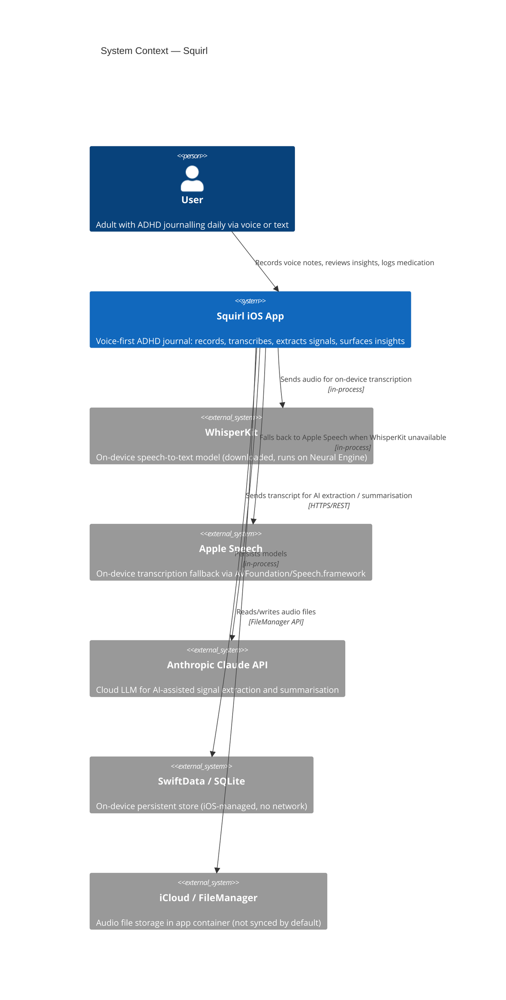
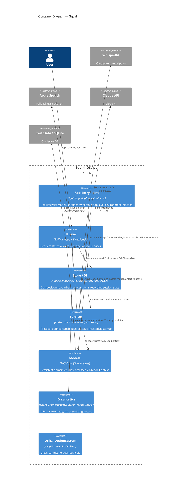

# C4 Component Diagram — Implementation Plan

> **For agentic workers:** REQUIRED SUB-SKILL: Use superpowers:subagent-driven-development (recommended) or superpowers:executing-plans to implement this plan task-by-task. Steps use checkbox (`- [ ]`) syntax for tracking.

**Goal:** Produce `docs/ARCHITECTURE-c4.md` — a full C4 model for the Squirl app with Context, Container, and Component diagrams rendered as Mermaid, each followed by a prose description table.

**Architecture:** Three levels of C4 diagrams in a single markdown file. Each diagram uses Mermaid `C4Context` / `C4Container` / `C4Component` syntax — renderable natively on GitHub and in VS Code with the Mermaid extension. Prose description tables accompany each diagram. No code is written — documentation artifact only.

**Tech Stack:** Markdown, Mermaid C4 syntax ([mermaid.js.org/syntax/c4.html](https://mermaid.js.org/syntax/c4.html)), `diagram` skill (for Mermaid generation), `swiftui-app-architecture-workflow` (boundary validation)

**Skills to invoke:**
- `diagram` — generate and validate Mermaid C4 syntax
- `swiftui-app-architecture-workflow` — confirm Container ownership boundaries
- `swift-architecture-skill` — confirm component relationships

---

## File Structure

| Output file | Purpose |
|---|---|
| `docs/ARCHITECTURE-c4.md` | The C4 diagrams + descriptions — created by this plan |

---

### Task 1: Scaffold document and write Level 1 — Context Diagram

The Context diagram answers: *Who uses the system and what external systems does it touch?*

**Files:**
- Create: `docs/ARCHITECTURE-c4.md`

- [ ] **Step 1: Invoke `diagram` skill** to generate the Mermaid C4Context block.

- [ ] **Step 2: Write the Context diagram**

Create `docs/ARCHITECTURE-c4.md` with:

```markdown
# Squirl — C4 Architecture Diagrams

> C4 model · Context → Container → Component
> Generated: 2026-06-28 · Mermaid diagrams render on GitHub and in VS Code (Mermaid extension).

---

## Level 1 — System Context

Who uses Squirl and what external systems does it touch?



### Context — Descriptions

| Element | Type | Responsibility |
|---|---|---|
| User | Person | Logs voice/text check-ins, reviews signal trends, logs medication |
| Squirl iOS App | System | The app being documented |
| WhisperKit | External | On-device neural transcription; downloaded model, runs locally |
| Apple Speech | External | Fallback transcription; always available, lower accuracy |
| Anthropic Claude API | External | Cloud LLM; used only when network available; optional path |
| SwiftData / SQLite | External | On-device persistence; no cloud sync |
| iCloud / FileManager | External | Audio file container; files stay on-device unless manually exported |
```

- [ ] **Step 3: Commit scaffold**

```bash
git add docs/ARCHITECTURE-c4.md
git commit -m "docs: scaffold C4 diagrams — Level 1 Context"
```

---

### Task 2: Level 2 — Container Diagram

The Container diagram answers: *What are the major deployable/runnable units inside the app?*

For a single-target iOS app, "containers" map to the major runtime subsystems — not separate processes, but logically separable runtime components.

**Files:**
- Modify: `docs/ARCHITECTURE-c4.md`

- [ ] **Step 1: Invoke `swiftui-app-architecture-workflow`** to validate Container boundary choices (App / Store / Services / UI layer).

- [ ] **Step 2: Append the Container diagram**

```markdown
---

## Level 2 — Container Diagram

What are the major subsystems inside Squirl and how do they communicate?



### Container — Descriptions

| Container | Technology | Responsibility |
|---|---|---|
| App Entry Point | `SquirlApp`, `AppModelContainer`, `SignalsReexport` | `@main` entry; owns `ModelContainer`; injects `AppDependencies` into environment; re-exports SquirlSignals types. |
| UI Layer | SwiftUI Views + ViewModels | All rendering and user interaction. ViewModels hold screen state; Views are passive. |
| Store / DI | `AppDependencies`, `RecordingStore`, `AppServices`, `PreviewSupport` | Composition root — the only layer that knows concrete service types. Injected at `App` level. |
| Services | Swift protocols + implementations | All side-effectful capabilities: audio I/O, transcription, NLP, AI calls, export. Protocol-typed so Views never import concrete backends. |
| Models | SwiftData `@Model` | Persistent entities. Mutated only through `ModelContext` passed at call sites. |
| Diagnostics | `DiagnosticsStore`, `MetricManager`, `ScreenTracker`, `SessionSnapshot` | Internal telemetry. Decoupled from all feature code. |
| Utils / DesignSystem | Pure Swift helpers | No business logic. `ScreenContainer`, `MedicationBarOverlay`, logging, constants, environment keys. |
```

- [ ] **Step 3: Commit**

```bash
git add docs/ARCHITECTURE-c4.md
git commit -m "docs(c4): add Level 2 Container diagram"
```

---

### Task 3: Level 3 — Component Diagram: Services Container

The Component diagram zooms into one Container. Start with Services — it has the most internal structure.

**Files:**
- Modify: `docs/ARCHITECTURE-c4.md`
- Read: `app-four/Services/Protocols.swift`, `app-four/Services/NoteExtraction/NLNoteExtractor.swift`

- [ ] **Step 1: Read `Protocols.swift`** — confirm all protocol names before writing the diagram.

- [ ] **Step 2: Append Services Component diagram**

```markdown
---

## Level 3 — Component Diagram: Services Container

```mermaid
C4Component
    title Components — Services Container

    Container_Boundary(services, "Services") {
        Component(protocols, "Protocols.swift", "Swift protocols", "Defines all service interfaces — the only thing ViewModels depend on")

        Component(audio_rec, "AudioRecordingServiceImpl", "AVFoundation", "Starts/stops/pauses microphone capture; streams buffers")
        Component(audio_store, "AudioFileStorageServiceImpl", "FileManager", "Reads/writes .m4a files in app container")
        Component(speech, "SpeechTranscriptionService", "Apple Speech.framework", "On-device transcription; always available")
        Component(whisper, "WhisperKitTranscriptionService", "WhisperKit", "On-device neural transcription; requires model download")
        Component(ai, "AIModelServiceImpl", "Anthropic SDK / URLSession", "Calls Claude API for extraction and summarisation")
        Component(nlp_pipeline, "NoteExtraction Pipeline", "NaturalLanguage.framework", "CueMatcher → TenseClassifier → Lexicon matching → signal scores")
        Component(nl_sum, "NLSummarizationService", "NaturalLanguage", "Extractive summarisation of transcript")
        Component(export, "ExportService", "Foundation", "Serialises recordings to CSV/plain-text for share sheet")
        Component(pending, "PendingTranscriptionServiceImpl", "SwiftData + async", "Queues transcription jobs for offline retry")
        Component(network, "NetworkConnectivity", "Network.framework", "NWPathMonitor reachability; gates cloud calls")
        Component(mock, "MockTranscriptionService", "Hardcoded fixtures", "Preview/test double — not in production target")
    }

    Container(store, "Store / DI", "AppDependencies, AppServices", "Instantiates and holds all components")
    Container(models_c, "Models", "SwiftData @Model types", "Persistent entities")
    System_Ext(whisperkit_ext, "WhisperKit runtime")
    System_Ext(claude_api_ext, "Claude API")
    System_Ext(speech_ext, "Apple Speech")

    Rel(store, protocols, "Injects concrete impl behind protocol interface")
    Rel(audio_rec, audio_store, "Hands completed recording buffer for persistence")
    Rel(whisper, whisperkit_ext, "Runs inference in-process")
    Rel(speech, speech_ext, "Streams audio via Speech.framework")
    Rel(ai, claude_api_ext, "HTTPS POST with transcript")
    Rel(nlp_pipeline, models_c, "Writes ExtractedNote to ModelContext")
    Rel(pending, models_c, "Reads/writes pending job queue")
    Rel(network, ai, "Gates API calls when offline")
```



### Services Components — Descriptions

| Component | File(s) | Key collaborators |
|---|---|---|
| Protocols | `Protocols.swift` | All ViewModels (depend on protocols only) |
| AudioRecordingServiceImpl | `Audio/AudioRecordingServiceImpl.swift` | `AudioFileStorageServiceImpl` |
| AudioFileStorageServiceImpl | `Audio/AudioFileStorageServiceImpl.swift` | FileManager |
| SpeechTranscriptionService | `Speech/SpeechTranscriptionService.swift` | Apple Speech.framework |
| WhisperKitTranscriptionService | `WhisperKit/WhisperKitTranscriptionService.swift` | WhisperKit runtime |
| AIModelServiceImpl | `AIModelServiceImpl.swift` | `NetworkConnectivity`, Claude API |
| NoteExtraction Pipeline | `NoteExtraction/` (7 files: NLNoteExtractor, CueMatcher, TenseClassifier, Lexicon, LexiconData, PersonalLexiconBuilder, NoteExtraction) | `NLNoteExtractor` orchestrates `CueMatcher`, `TenseClassifier`, `Lexicon*`, `PersonalLexiconBuilder` |
| NLSummarizationService | `NLSummarizationService.swift` | `SummarizationService` impl via Apple NaturalLanguage (`NLNoteExtractor` pipeline; no network) |
| ExportService | `ExportService.swift` | `RecordingStore` (reads recordings) |
| PendingTranscriptionServiceImpl | `PendingTranscriptionServiceImpl.swift` | `ModelContext`, `TranscriptionService` |
| NetworkConnectivity | `Connectivity/NetworkConnectivity.swift` | `AIModelServiceImpl` |
| MockTranscriptionService | `Mock/MockTranscriptionService.swift` | SwiftUI Previews only |
```

- [ ] **Step 3: Commit**

```bash
git add docs/ARCHITECTURE-c4.md
git commit -m "docs(c4): add Level 3 Services component diagram"
```

---

### Task 4: Level 3 — Component Diagram: UI Layer (ViewModels + Screens)

**Files:**
- Modify: `docs/ARCHITECTURE-c4.md`
- Read: `app-four/Views/RootTabView.swift`

- [ ] **Step 1: Read `RootTabView.swift`** — confirm tab structure (tabs, navigation stack).

- [ ] **Step 2: Append UI Layer Component diagram**

```markdown
---

## Level 3 — Component Diagram: UI Layer

```mermaid
C4Component
    title Components — UI Layer (Screens + ViewModels)

    Container_Boundary(ui, "UI Layer") {
        Component(root, "RootTabView", "SwiftUI TabView", "Four-tab shell: Check-In · Library · Insights · Settings")

        Component(checkin_v, "CheckInView", "SwiftUI", "Voice/text check-in composer")
        Component(checkin_vm, "CheckInViewModel", "Observable", "Records audio, triggers transcription + extraction")

        Component(library_v, "CalendarLibraryView", "SwiftUI", "Calendar grid of past check-ins")
        Component(library_vm, "MoodLibraryViewModel + CalendarMonthModel", "Observable", "Aggregates recordings by date; mood palette")

        Component(insights_v, "InsightsView", "SwiftUI", "Monthly signal trend dashboard")
        Component(insights_vm, "InsightsViewModel (+Signals)", "Observable", "Computes signal averages, weekday strips, mood bubbles")

        Component(detail_v, "RecordingDetailView", "SwiftUI", "Full recording: transcript, signals, notes, audio player")
        Component(detail_vm, "RecordingDetailViewModel", "Observable", "Playback, extraction review, note editing")

        Component(settings_v, "SettingsView", "SwiftUI", "App preferences, export, medication bar config")
        Component(settings_vm, "SettingsViewModel", "Observable", "Reads/writes AppSettings via ModelContext")

        Component(medbar_v, "MedicationBarView", "SwiftUI overlay", "Floating dose bar above tab bar")
        Component(medbar_vm, "MedicationBarViewModel", "Observable", "Dose state, timing, catalog lookup")

        Component(extraction_v, "ExtractionReviewView", "SwiftUI", "AI extraction review sheet — edit extracted signals before saving")
        Component(extraction_vm, "ExtractionReviewViewModel", "Observable", "Manages extraction edits; persists via ModelContext")

        Component(processing_vm, "ProcessingViewModel", "Observable", "Post-recording pipeline: transcription → summarisation → save")
        Component(playback_vm, "AudioPlaybackViewModel", "Observable", "AVPlayer controls for in-detail audio playback")
        Component(medpicker_vm, "MedicationPickerViewModel", "Observable", "Medication selection for MedicationLogSheet")
        Component(daytimeline, "DayTimeline", "Observable", "Ordered timeline entries for a single day in LibraryView")

        Component(components, "Reusable Components", "SwiftUI Views", "19 files: DayCard, RecordingRow, AudioPlayerView, TagFlowView, Chip, GlyphRampPicker, TimelineRow, TimelineBead, MedicationLogSheet, ModelDownloadRow, etc.")
        Component(insights_sub, "Insights Sub-Views", "SwiftUI Views", "8 files: MoodBubbleChart, SignalStripsView, DailyRhythmMatrix, ConnectionCardsView, SignalAverageGauges, MonthSelectorScrollView, MoodLegend, InsightsSectionHeader")
        Component(feedback, "Feedback Views", "SwiftUI + UIKit", "5 files: FeedbackButton, IssueReportView, MailComposeView, ScreenshotCapture, ShareSheetView")
        Component(onboarding, "WelcomeView + WelcomeViewModel", "SwiftUI", "First-launch onboarding flow")
    }

    Container(store_c, "Store / DI", "AppDependencies, RecordingStore", "Composition root")
    Container(models_c2, "Models", "SwiftData @Model", "@Model types via @Query")

    Rel(root, checkin_v, "Tab 1")
    Rel(root, library_v, "Tab 2")
    Rel(root, insights_v, "Tab 3")
    Rel(root, settings_v, "Tab 4")
    Rel(root, medbar_v, "Overlay above tabs")
    Rel(checkin_v, checkin_vm, "@StateObject")
    Rel(library_v, library_vm, "@StateObject")
    Rel(insights_v, insights_vm, "@StateObject")
    Rel(detail_v, detail_vm, "@StateObject")
    Rel(settings_v, settings_vm, "@StateObject")
    Rel(medbar_v, medbar_vm, "@StateObject")
    Rel(detail_v, extraction_v, "Pushes extraction review sheet")
    Rel(extraction_v, extraction_vm, "@State (Observable)")
    Rel(detail_vm, playback_vm, "Owns playback VM as child")
    Rel(medbar_v, medpicker_vm, "Presents MedicationLogSheet with picker")
    Rel(checkin_vm, store_c, "@Environment(AppDependencies)")
    Rel(library_vm, models_c2, "@Query / ModelContext")
    Rel(library_vm, daytimeline, "Creates DayTimeline per day")
    Rel(insights_vm, models_c2, "@Query / ModelContext")
    Rel(processing_vm, store_c, "TranscriptionService + SummarizationService via AppDependencies")
```



### UI Layer Components — Descriptions

| Component | File(s) | ViewModel | Key dependencies |
|---|---|---|---|
| RootTabView | `Views/RootTabView.swift` | none | Navigation shell |
| CheckInView | `Views/CheckIn/CheckInView.swift` | `CheckInViewModel` | `AudioRecordingService`, `TranscriptionService` |
| CheckInViewModel | `ViewModels/CheckInViewModel.swift` | — | `AudioRecordingService`, `TranscriptionService`, `SummarizationService` |
| CalendarLibraryView | `Views/Library/CalendarLibraryView.swift` | `MoodLibraryViewModel` | `ModelContext` |
| MoodLibraryViewModel | `ViewModels/MoodLibraryViewModel.swift` | — | `ModelContext`, `DayTimeline` |
| DayTimeline | `ViewModels/DayTimeline.swift` | — | `ModelContext` |
| InsightsView | `Views/InsightsView.swift` | `InsightsViewModel` | `ModelContext` |
| InsightsViewModel | `ViewModels/InsightsViewModel.swift` + `InsightsViewModel+Signals.swift` | — | `ModelContext` |
| RecordingDetailView | `Views/RecordingDetailView.swift` | `RecordingDetailViewModel` | `RecordingStore`, `SummarizationService`, `TranscriptionService` |
| RecordingDetailViewModel | `ViewModels/RecordingDetailViewModel.swift` | — | `RecordingStore`, `SummarizationService`, `TranscriptionService` |
| AudioPlaybackViewModel | `ViewModels/AudioPlaybackViewModel.swift` | — | AVPlayer, `AudioFileStorageService` |
| ExtractionReviewView | `Views/ExtractionReviewView.swift` | `ExtractionReviewViewModel` | `ModelContext` |
| ExtractionReviewViewModel | `ViewModels/ExtractionReviewViewModel.swift` | — | `ModelContext`, `SummarizationService` |
| ProcessingViewModel | `ViewModels/ProcessingViewModel.swift` | — | `TranscriptionService`, `SummarizationService` |
| SettingsView | `Views/SettingsView.swift` | `SettingsViewModel` | `AppSettings` |
| SettingsViewModel | `ViewModels/SettingsViewModel.swift` | — | `ModelContext` (`AppSettings`) |
| MedicationBarView | `Views/Components/MedicationBarView.swift` | `MedicationBarViewModel` | `MedicationCatalog` |
| MedicationBarViewModel | `ViewModels/MedicationBarViewModel.swift` | — | `ModelContext`, `MedicationCatalog` |
| MedicationPickerViewModel | `ViewModels/MedicationPickerViewModel.swift` | — | `MedicationCatalog` |
| Reusable Components | `Views/Components/` (19 files) | varies | Receive data via init parameters |
| Insights Sub-Views | `Views/Insights/` (8 files) | none (data from `InsightsViewModel`) | |
| Feedback Views | `Views/Feedback/` (5 files) | none | UIKit mail compose, share sheet |
| WelcomeView | `Views/Onboarding/WelcomeView.swift` | `WelcomeViewModel` (co-located in `Views/Onboarding/`) | `AppSettings` |
```

- [ ] **Step 3: Commit**

```bash
git add docs/ARCHITECTURE-c4.md
git commit -m "docs(c4): add Level 3 UI Layer component diagram"
```

---

### Task 5: Final review and validation

**Files:**
- Read: `docs/ARCHITECTURE-c4.md`

- [ ] **Step 1: Verify all Mermaid blocks are valid**

Invoke the `diagram` skill and pass each Mermaid block for validation. Alternatively install and run the Mermaid CLI (`npm install -g @mermaid-js/mermaid-cli`) then:

```bash
mmdc -i docs/ARCHITECTURE-c4.md -o /dev/null
```

Fix any parse errors before proceeding. Do NOT use mermaid.live — it requires a browser and cannot be automated.

- [ ] **Step 2: Verify all component names match actual file names**

Run:
```bash
find app-four -name "*.swift" | xargs basename -s .swift | sort
```
Cross-check against every `Component(...)` label in the diagrams. If a name drifts, fix the label.

- [ ] **Step 3: Verify prose tables have no gaps**

Every component in every diagram must have a matching row in the description table below it. Add any missing rows.

- [ ] **Step 4: Final commit**

```bash
git add docs/ARCHITECTURE-c4.md
git commit -m "docs(c4): finalize C4 component diagrams — all levels complete"
```

---

## Self-Review

**Spec coverage:** Context (Level 1), Container (Level 2), and Component (Level 3) diagrams all present. Two Component diagrams cover the two most complex containers (Services, UI Layer). Store, Models, Diagnostics, Utils are described at Container level — they are simple enough that a Component-level diagram adds no value.

**Placeholder scan:** No TBD/TODO. All Mermaid element IDs use snake_case, all labels use real file/class names from the authoritative directory listing (118 files). `Container_Ext` has been replaced with `Container` throughout — `Container_Ext` is not a valid C4Component keyword.

**Type consistency:** Protocol names (`AudioRecordingService`, `TranscriptionService`, `SummarizationService`, etc.) used in diagrams match `Protocols.swift`. ViewModel names match files under `ViewModels/` and `Views/Onboarding/`. `NoteExtractorService` does not exist and does not appear anywhere in the plan.
