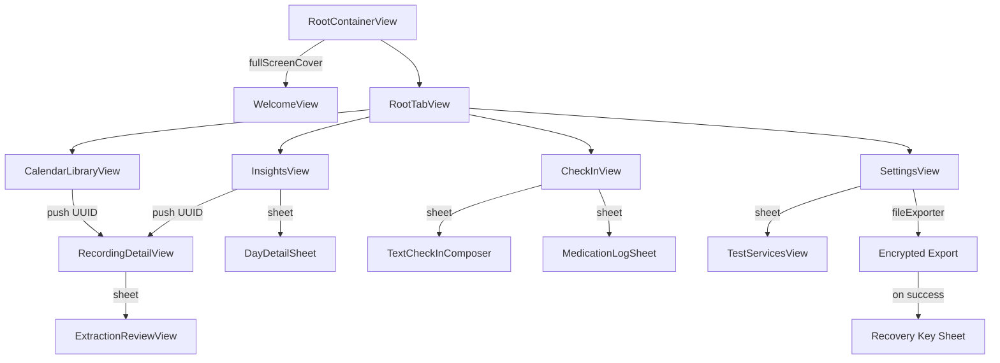
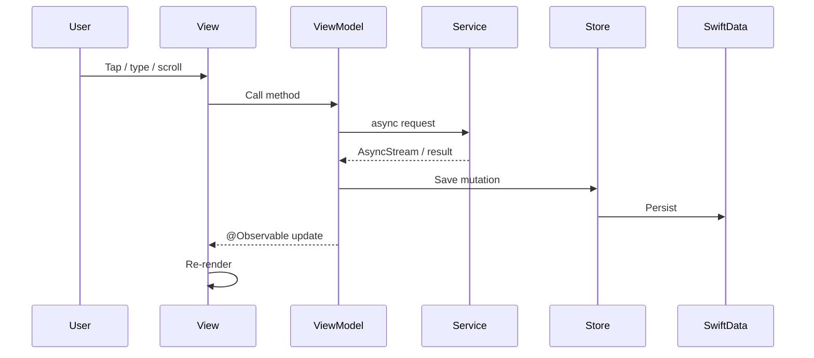

# UI Architecture

_Last updated: 2026-06-28_

This document describes how Squirl's user interface is organized, how screens navigate, and how state flows from the user into the persistent model.

---

## Table of Contents

- [Navigation Model](#navigation-model)
- [Screen Container](#screen-container)
- [View vs. ViewModel Responsibilities](#view-vs-viewmodel-responsibilities)
- [View State Flow](#view-state-flow)
- [Common Patterns](#common-patterns)
- [Accessibility Patterns](#accessibility-patterns)
- [Common Pitfalls](#common-pitfalls)
- [Adding a New Screen](#adding-a-new-screen)

---

## Navigation Model

Squirl uses a **four-tab root** (`RootTabView`) with inline navigation destinations.



### Tab Enum

Tabs are keyed by a strongly typed `Tab` enum instead of integer indices:

```swift
enum Tab: Hashable {
    case calendar
    case checkIn
    case insights
    case settings
}
```

### Inline Navigation

Calendar and Insights use `NavigationPath` bound to `ScreenContainer` and push `RecordingDetailView` via `.navigationDestination(for: UUID.self)`. The detail view is passed the resolved `Recording`, `RecordingStore`, and `AppServices` explicitly.

### Sheets

Sheets are used for:

- Text check-in (`TextCheckInComposer`)
- Manual medication logging (`MedicationLogSheet`)
- Extraction review/edit (`ExtractionReviewView`)
- Day detail (`DayDetailSheet`)
- Debug console (`TestServicesView`)
- Recovery key display

---

## Screen Container

Most top-level screens are wrapped in `ScreenContainer` (`DesignSystem/ScreenContainer.swift`). It provides:

- Consistent safe-area, background (`Theme.background`), and navigation-bar styling.
- Optional medication bar overlay (`showsMedicationBar`, default `true`).
- Optional scroll management (`scrollable`, default `true`; `scrollResetToken` for programmatic scroll-to-top).
- Optional `NavigationPath` binding (views own the path and pass `$path` in; `ScreenContainer` only creates an internal fallback when none is supplied).

Example:

```swift
ScreenContainer(title: "", showsMedicationBar: true, scrollable: false, path: $path) {
    // screen content
}
```

---

## View vs. ViewModel Responsibilities

| Concern | View | ViewModel |
|---------|------|-----------|
| Render UI | ✅ | ❌ |
| Handle user gestures (call ViewModel methods) | ✅ | ❌ |
| Own local presentation state (sheets, alerts, animations) | ✅ | ❌ |
| Own screen-level business state | ❌ | ✅ |
| Call Services / Store | ❌ | ✅ |
| Parse/format values for display | ✅ | ✅ (when non-trivial) |
| Persist data | ❌ | ✅ (via Store) |
| Manage long-lived `Task` lifetimes | ❌ | ✅ |
| Manage short-lived presentation tasks (animation cues, export prep) | ✅ | ❌ |

### What Goes in the View

- `@State` for purely local UI state (sheet visibility, scroll position, animation flags).
- `@Environment` property wrappers for injected dependencies.
- `@ViewBuilder` decomposition.
- Accessibility modifiers.

### What Goes in the ViewModel

- `@Observable` state that drives the UI.
- References to active `Task`s.
- Methods that call services or the Store.
- Validation and computed properties derived from persisted data.

### What Goes in the Store

- CRUD operations on `Recording` and related entities.
- Cross-screen notifications (e.g., `.medicationEventsDidChange`).
- Loading and filtering of persisted data.

---

## View State Flow

### Standard Screen Pattern

The top-level tab views receive `RecordingStore` and `AppServices` via initializer from `RootTabView`; child views pull dependencies from the environment when needed.

```swift
struct SomeView: View {
    @State private var viewModel: SomeViewModel
    @Environment(AppServices.self) private var services
    private let store: RecordingStore
    // additional environment and local state

    init(store: RecordingStore, services: AppServices, ...) {
        self.store = store
        _viewModel = State(wrappedValue: SomeViewModel(store: store, services: services))
    }

    var body: some View { ... }
}
```

### Data Flow



Steps:

1. **User action** triggers a method on the ViewModel.
2. **ViewModel** calls a Service or the Store.
3. **Service** returns a value or an `AsyncStream`.
4. **ViewModel** updates the `@Model` object (often via the Store) and/or its own `@Observable` state.
5. **Store** persists the `@Model` change to SwiftData.
6. **View** re-renders from observed state.

### Two-Way Binding to ViewModel

For `@Observable` ViewModels, use `@Bindable` when the view needs write access:

```swift
var body: some View {
    @Bindable var viewModel = viewModel
    Toggle("Setting", isOn: $viewModel.someFlag)
}
```

---

## Common Patterns

### View Decomposition

Large screens are split into private `@ViewBuilder` properties or small `fileprivate` structs. Example: `CheckInView` uses `captureStage`, `idleHeader`, `recordingHeader`, `recordingCentre`, `failureRecovery`, and `CheckInSavedView`.

### Conditional Animation

Respect Reduce Motion:

```swift
.animation(reduceMotion ? nil : Motion.smooth, value: someState)
```

### Preview Environment

Previews use `.withPreviewEnvironment()` to inject mock services and the preview SwiftData container:

```swift
#Preview {
    CheckInView(store: .preview, services: .preview)
        .withPreviewEnvironment()
}
```

---

## Accessibility Patterns

- **VoiceOver live regions:** Timer and status updates use `.accessibilityAddTraits(.updatesFrequently)`.
- **Announcement gate:** Prompt advances are deferred while the user is speaking so VoiceOver does not talk over them.
- **Reduced Motion:** Animations should be conditional on `accessibilityReduceMotion`. Some legacy or system-driven transitions may still animate unconditionally; new code must honor the setting.
- **Dynamic Type:** Typography scales via `UIFontMetrics`.
- **Custom accessibility labels:** Replaced when the visual label is insufficient (e.g., "Start voice check-in").
- **Grouped elements:** Complex rows use `.accessibilityElement(children: .combine)` or `.ignore` with explicit labels.

---

## Common Pitfalls

1. **Do not access `AppDependencies` from Views.** Pull `AppServices` or `RecordingStore` from the environment, or receive them via initializer.
2. **Do not mutate `@Model` objects directly from Views.** Route mutations through the ViewModel or Store.
3. **Do not perform heavy work in `body`.** Offload to the ViewModel or a detached task.
4. **Respect Reduce Motion.** Never unconditionally animate.
5. **Do not mutate `NavigationPath` inside `.navigationDestination` or `.onAppear`.** This causes "NavigationRequestObserver tried to update multiple times per frame" warnings.
6. **Cancel structured tasks on view disappear or state reset.** Leaked tasks can mutate freed `@Model` objects.
7. **Do not access `RecordingStore.recordings` from background actors.** `Recording` is `@Model` and must be touched on `@MainActor`.

---

## Adding a New Screen

1. Create the ViewModel in `app-four/ViewModels/`:
   - Mark `@Observable` and `@MainActor`.
   - Inject `RecordingStore` and `AppServices` (or a subset) via initializer.
   - Keep state flat and focused on the screen.

2. Create the View in `app-four/Views/<Screen>/`:
   - Hold the ViewModel as `@State`.
   - Pull dependencies from environment.
   - Decompose the body into small subviews.
   - Add a preview with `.withPreviewEnvironment()`.

3. Add the screen to navigation:
   - For a new tab: update `RootTabView` and `Tab`.
   - For a push: add a `.navigationDestination` in the parent.
   - For a sheet: present via `.sheet`.

4. Update this document and the relevant per-screen README.
