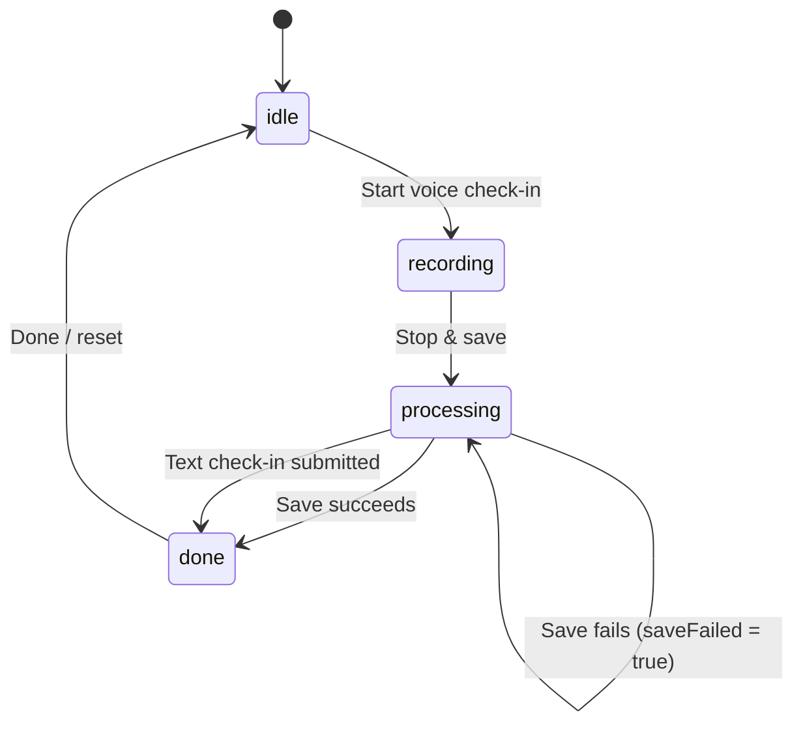

# Check-In Screen

_Last updated: 2026-06-28_
The check-in screen is the app's primary capture surface. It supports both voice and text entry and is designed to get the user in and out in under a minute.

## Files

| File | Purpose |
|------|---------|
| `CheckInView.swift` | Main capture UI: idle hub, recording stage, save confirmation, failure recovery |
| `CrescentRing.swift` | Animated recording indicator ring |
| `TextCheckInComposer.swift` | Signal-first text check-in sheet |

## ViewModel

- [`CheckInViewModel`](../../../app-four/ViewModels/CheckInViewModel.swift)
- [`ProcessingViewModel`](../../../app-four/ViewModels/ProcessingViewModel.swift) — post-transcription NLP extraction

## State Machine

`RecordingState` has `.idle`, `.recording`, `.paused`, `.processing`, `.done`, but `CheckInViewModel` only uses `.idle`, `.recording`, `.processing`, `.done`. `saveFailed` is a separate `Bool` that keeps the UI in `.processing` while swapping in the recovery overlay.

## User Flows

### Voice Check-In

1. User taps **Speak check-in** or the app auto-starts via deep link (`whispernotes://checkin`).
2. `CheckInViewModel.startRecording()` checks disk space, requests microphone permission, and starts the recorder.
3. The crescent ring grows and a rotating prompt advances every `promptInterval` seconds (loaded from `AppSettings`).
4. User taps **Stop & save**; the audio file is buffered in `pendingSave` and saved.
5. On save success, `CheckInSavedView` confirms capture and the state becomes `.done`.
6. Transcription runs in the background via `CheckInViewModel`; NLP extraction runs via `ProcessingViewModel`.

### Text Check-In

1. User taps **Type note**.
2. `TextCheckInComposer` sheet opens with mood/energy/focus pickers and a note field.
3. User submits; `CheckInViewModel.saveTextCheckIn(_:)` persists the draft.
4. If a note is present, NLP fills only the fields the user left blank (`fillOnly: true`).

### Manual Medication Log

1. User taps **Log meds**.
2. `MedicationLogSheet` opens.
3. The dose is logged via `MedicationBarViewModel` and appears in the medication bar overlay.

## Screen Container

`CheckInView` is wrapped in `ScreenContainer` with the medication bar overlay visible and scroll disabled.

## Key UI States

| State | View |
|-------|------|
| `idle` | Hub with date headline, first-launch hint, Speak/Log/Type buttons |
| `recording` | Crescent ring, timer, rotating prompt, stop/cancel controls |
| `processing` | Stop button shows spinner, headline reads "Saving…" |
| `processing` + `saveFailed` | Inline recovery: "Couldn't save that one" with Try again / Discard |
| `done` | `CheckInSavedView` with checkmark and "Done" button |

## Alerts & Edge Cases

- **Microphone permission denied** — system alert + "Open Settings" fallback.
- **Low disk space** — alert when available space is below the recording threshold.
- **Text save failure** — `textSaveFailed` drives an inline retry surface in `TextCheckInComposer`.
- **8-minute soft cap** — a single calm "Wrapping up soon" cue appears ~30s before the cap.

## Accessibility Notes

- Timer is a live region updated once per second.
- Prompt advances are announced only when the user is not actively speaking (active-voice gate).
- First-launch whisper hint dismisses on first capture start.

## Related Specs

- Spec 024 — Check-in capture flow (`specs/024-calendar-checkin-settings-qa/`)
- Spec 019 — Day card / timeline (`specs/019-daycard-mood-block/`)
