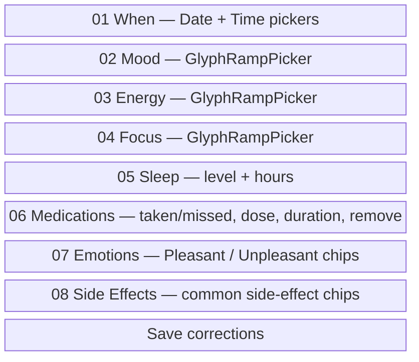

# Extraction Review Screen

_Last updated: 2026-06-28_
The extraction review screen lets the user correct signals, medications, emotions, and side effects extracted from a voice or text check-in. Corrections feed the personal lexicon where tagging is wired.

## File

- `ExtractionReviewView.swift`

## ViewModel

- [`ExtractionReviewViewModel`](../../../app-four/ViewModels/ExtractionReviewViewModel.swift)

## Screen Structure

The sheet presents a scrollable form with hairline-separated fields:

## User Flow

1. User taps the pencil in `RecordingDetailView`.
2. `ExtractionReviewViewModel` is initialized from the persisted `Recording`.
3. The sheet opens with current extracted values.
4. User edits and taps **Save** in the toolbar.
5. `confirm()` applies changes to the `Recording`.
6. Corrected fields insert `RecordingTag(source: .userCorrected)` entries.
7. The sheet dismisses via the `onComplete` closure.

## Key Behaviors

- Sheet uses `.presentationDetents([.large])` and `.presentationDragIndicator(.visible)`.
- Toolbar has **Cancel** and **Save** buttons.
- Medication rows are identified by `editRowID` (not name or value equality) to handle duplicate doses and in-flight edits.
- `MedicationEvent` rows with `source == .transcript` are replaced on save; manual events are preserved.
- Side effects can be toggled but there is no custom-entry text field.
- Sleep hours use a picker of common durations plus a custom text field.

## Related Specs

- Spec 020 — Emotions lexicon
- Spec 027 — Recording detail UX pass (`specs/027-recording-detail-ux-pass/`)
