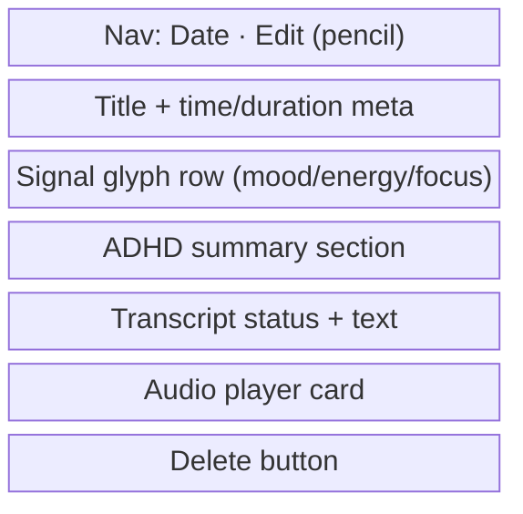

# Recording Detail Screen

_Last updated: 2026-06-28_
The recording detail screen shows a single check-in: its title, signal glyphs, structured summary, transcript, audio player, and edit/delete affordances.

## File

- `RecordingDetailView.swift`

## ViewModel

- [`RecordingDetailViewModel`](../../../app-four/ViewModels/RecordingDetailViewModel.swift)

## Screen Structure

## User Flows

### Edit Extracted Signals

1. User taps the pencil icon in the navigation bar.
2. `ExtractionReviewView` is presented as a sheet.
3. Corrections are saved back to the `Recording`.
4. Corrected fields generate `RecordingTag(source: .userCorrected)` entries where applicable.

### Retry Failed Transcription

1. If a recording's status is `.failed`, the detail view shows a retry affordance.
2. Tapping retry calls `RecordingDetailViewModel.retryTranscription()`.
3. The model re-transcribes the audio file and then regenerates the summary.

### Regenerate Summary

- `RecordingDetailViewModel` has `regenerateSummary()` / `startRegenerate()` methods, but the UI does not currently expose a regenerate affordance.

### Delete

1. User taps **Delete**.
2. A confirmation dialog appears.
3. On confirm, the view sets `pendingDelete = true` and dismisses.
4. `.onDisappear` calls `viewModel.delete()` to avoid mutating a detached `@Model` while the sheet is still mounted.

## Key Behaviors

- Wrapped in `ScreenContainer` with medication bar overlay.
- `recording` is `let`-bound; mutations route through ViewModel methods or the Store.
- The navigation title shows the recording date.
- The title block uses `displayTitle` (e.g., "Transcribing…" / "Ready shortly…" / generated title).
- Audio playback is handled by `AudioPlayerView` + `AudioPlaybackViewModel`.
- The medication bar overlay is shown via `.medicationBarOverlay()`.

## Related Specs

- Spec 027 — Recording detail UX pass (`specs/027-recording-detail-ux-pass/`)
