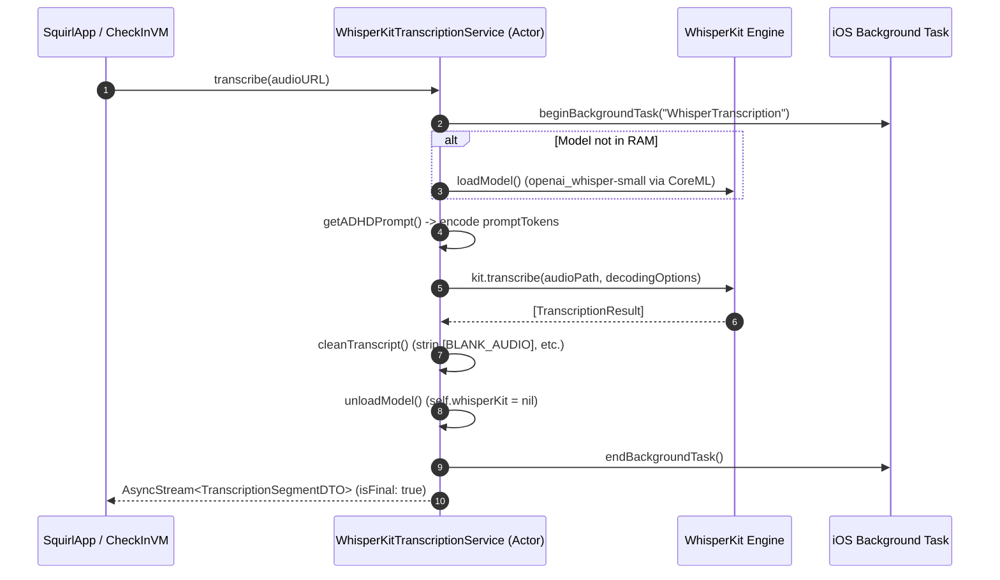
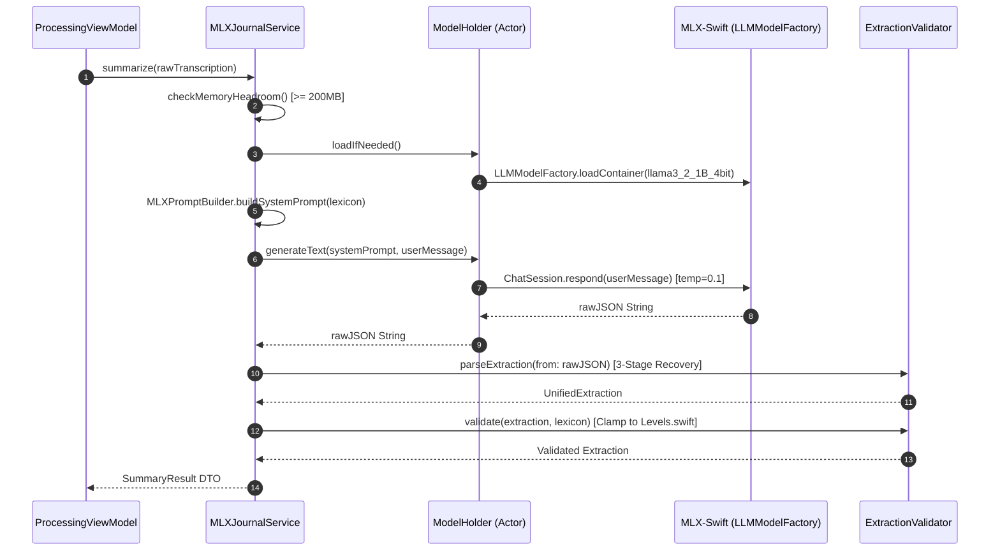
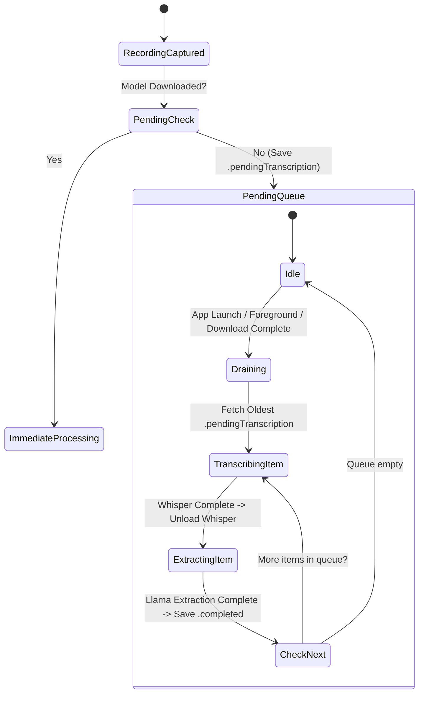

# Whisper & Llama Startup, Execution, and Architecture Guide

## 1. Overview & Architecture

**Squirl** (WhisperNotes) is a 100% on-device, privacy-first iOS ADHD journal application. It records voice check-ins (up to 15 minutes / ~3,000 tokens), transcribes them on-device using **WhisperKit**, and extracts structured clinical signals (mood, energy, focus, sleep, medications, emotions, topics) using **Llama 3.2 1B (4-bit quantized)** via **MLX-Swift**.

```mermaid
graph TD
    A[User Voice Input / Audio File] --> B[CheckInViewModel]
    B --> C{Whisper Model Downloaded?}
    C -- No --> D[Save as .pendingTranscription]
    C -- Yes --> E[WhisperKitTranscriptionService]
    
    subgraph STAGE 1: Transcription (WhisperKit)
        E --> F[Check/Load Whisper Model]
        F --> G[Begin iOS Background Task]
        G --> H[Run WhisperKit Inference with ADHD Prompt]
        H --> I[Filter Non-Speech Markers]
        I --> J[UNLOAD WhisperKit Model (Peak Shaving)]
    end
    
    J --> K[Raw Transcript String]
    K --> L[ProcessingViewModel]
    L --> M[MLXJournalService]
    
    subgraph STAGE 2: LLM Extraction (Llama 3.2 via MLX-Swift)
        M --> N[Check os_proc_available_memory >= 200MB]
        N --> O[Lazy Load Llama 3.2 1B 4-bit Container]
        O --> P[Build System Prompt from Lexicon]
        P --> Q[Execute MLX-Swift ChatSession Inference]
        Q --> R[3-Stage JSON Recovery]
        R --> S[Validate & Clamp against Levels.swift Enums]
    end
    
    S --> T[Persist Summary & Medication Events to SwiftData]
```

---

## 2. Model Lifecycle & Memory Safety (Peak Shaving & Jetsam Controls)

### Hardware Baseline & Constraints
* **Baseline Target**: iPhone 12 Pro (A14 Bionic, 6GB RAM, iOS 17+).
* **Jetsam Limit**: Foreground app memory ceiling is dynamically enforced by iOS (~2.5GB to 3.0GB RAM). The app includes the `com.apple.developer.kernel.increased-memory-limit` entitlement.
* **Footprint Breakdown**:
  * **WhisperKit (`openai_whisper-small`)**: ~150MB RAM.
  * **Llama 3.2 1B (4-bit)**: ~740MB RAM (weights + framework + KV cache).
  * Combined concurrently with CoreML/Metal GPU buffers, total memory usage risks exceeding available headroom.

### Peak Shaving Strategy
To prevent Jetsam Out-Of-Memory (OOM) crashes, the app enforces **Peak Shaving**:
1. **Unload Before Handoff**: `WhisperKitTranscriptionService` explicitly unloads `whisperKit` (`self.whisperKit = nil`) **before** signaling stream completion, completely freeing Metal/CoreML buffers before Llama is initialized.
2. **Headroom Gate**: Before loading Llama 3.2 1B weights, `MLXJournalService` queries `os_proc_available_memory()` to ensure at least 200MB of free RAM headroom. If memory is insufficient, it throws `SummarizationError.insufficientMemory`, triggering a safe fallback without crashing.
3. **Cold Start Lazy Loading**: Neither model is loaded at app startup. Models are initialized on demand and unloaded immediately after use.

---

## 3. Whisper Startup & Execution Deep-Dive

### Download & Verification (`AIModelServiceImpl`)
* **Location**: `ModelConstants.whisperDownloadBase` (`~/Library/whisperkit`).
* **Pre-flight Checks**: Minimum 150MB disk space check via `freeSpaceProvider`. Checks network state (Wi-Fi vs Cellular settings).
* **Background Transfer**: Uses `UIApplication.shared.beginBackgroundTask(withName: "WhisperDownload")`.
* **Filesystem Truth**: Verified by `findWhisperModelFolder`, checking that `AudioEncoder.mlmodelc/weights` and `config.json` exist on disk.

### Model Startup & ADHD Bias Prompting (`WhisperKitTranscriptionService`)
* Implemented as an `actor` conforming to `TranscriptionService`.
* Sets `ModelComputeOptions` setting both audio encoder and text decoder to `ComputeEnvironment.preferredUnits` (CoreML / Neural Engine / Metal).
* **ADHD Prompt Tokenization**: If `medicalPromptEnabled` is enabled in `UserDefaults`, tokenizes an ADHD-specific prompt (containing names of common medications like Concerta, Vyvanse, Ritalin, Adderall, etc.) using `kit.tokenizer?.encode(text:)` and passes them as `promptTokens` in `DecodingOptions`.

### Inference & Execution Flow
1. **Background Task**: Wraps execution in `beginBackgroundTask(withName: "WhisperTranscription")` so iOS does not suspend the process mid-inference.
2. **Inference**: Executes `kit.transcribe(audioPath: url.path, decodeOptions: options)`.
3. **Transcript Cleanup**: Employs regex (`nonSpeechMarker`) to strip artifacts like `[BLANK_AUDIO]`, `[MUSIC]`, `(inaudible)`.
4. **RAM Cleanup (Peak Shaving)**: Immediately calls `await unloadModel()` (`whisperKit = nil`) before yielding final stream completion.



---

## 4. Llama 3.2 Startup & Execution Deep-Dive

### Architecture (`MLXJournalService`)
* Conforms to `SummarizationService`. Implemented as a nonisolated struct containing a private actor `ModelHolder`.
* **Model Configuration**: `LLMRegistry.llama3_2_1B_4bit` (Llama 3.2 1B Instruct 4-bit) running via Meta's **MLX-Swift** framework (`MLX`, `MLXNN`, `MLXLLM`, `MLXLMCommon`).

### Prompt Construction (`MLXPromptBuilder`)
* **Curated Lexicon Integration**: Dynamically loads `lexicon.json` (718 entries across 27 categories) using `LexiconLoader.loadBundled()`.
* Generates a strict system prompt containing:
  - Allowed categorical signal labels (`MoodLevel`, `EnergyLevel`, `FocusLevel`, `SleepLevel`).
  - Common ADHD vocabulary & slang mapping (e.g., "brain fog", "bouncing off the walls", "no spoons").
  - Known medication names (e.g., Concerta, Vyvanse, Ritalin).
  - Few-shot JSON output examples.

### Inference & Execution Flow
1. **Memory Check**: `MLXJournalService.checkMemoryHeadroom()` verifies `os_proc_available_memory() >= 200MB`.
2. **Lazy Container Load**: `LLMModelFactory.shared.loadContainer(configuration: config)` loads Llama 3.2 weights into Unified Memory.
3. **Detached Task Execution**: Runs inference in `Task.detached(priority: .userInitiated)` calling `ChatSession(modelContainer, instructions: prompt, generateParameters: GenerateParameters(temperature: 0.1)).respond(to: userMessage)`. Low temperature (0.1) enforces deterministic JSON structure.

### Robust 3-Stage Recovery & Validation (`ExtractionValidator`)
1. **Stage 1 (Direct Decode)**: Attempts standard `JSONDecoder` parse into `UnifiedExtraction`.
2. **Stage 2 (Markdown Strip)**: Strips markdown codeblock markers (` ```json ... ``` `) and re-attempts decode.
3. **Stage 3 (Substring Regex)**: Extracts first matching `{ ... }` JSON block from raw text and decodes.
4. **Fallback**: If all 3 stages fail or memory is insufficient, returns `ExtractionValidator.fallbackResult(rawTranscript:)`.
5. **Validation & Clamping**: `ExtractionValidator.validate()` checks extracted strings against exact cases in `Levels.swift` enums and lexicon allowlists before saving.



---

## 5. Offline Queue & Background Draining (`PendingTranscriptionServiceImpl`)

When recordings are captured before the Whisper model has finished downloading:
1. `CheckInViewModel` flags the saved recording with `status = .pendingTranscription`.
2. `SquirlApp` triggers `PendingTranscriptionService.drainIfModelReady()` on:
   - App launch (`.task`).
   - Scene phase transitions (`scenePhase == .active`).
   - Background model download completion.
3. `PendingTranscriptionServiceImpl` serializes execution across pending items (oldest first), running each through transcription and extraction sequentially to prevent double-inference memory contention.



---

## 6. Codebase File Map & Reference

| Component / Layer | Primary File | Key Responsibility |
| :--- | :--- | :--- |
| **Model Manager** | [`AIModelServiceImpl.swift`](file:///Users/caesargrey/Projects/app-four-llama/app-four/Services/AIModelServiceImpl.swift) | Downloads & deletes models; checks disk space & network state; verifies local paths. |
| **Whisper Service** | [`WhisperKitTranscriptionService.swift`](file:///Users/caesargrey/Projects/app-four-llama/app-four/Services/WhisperKit/WhisperKitTranscriptionService.swift) | Manages `WhisperKit` actor, ADHD prompt injection, streaming transcription, non-speech marker filtering, and **Peak Shaving** model unloading. |
| **Llama Service** | [`MLXJournalService.swift`](file:///Users/caesargrey/Projects/app-four-llama/app-four/Services/MLXJournalService.swift) | Manages Llama 3.2 1B (4-bit) container via MLX-Swift, checks memory headroom via `os_proc_available_memory()`, and handles inference execution. |
| **Prompt Builder** | [`MLXPromptBuilder.swift`](file:///Users/caesargrey/Projects/app-four-llama/app-four/Services/MLXPromptBuilder.swift) | Builds dynamic system prompts using `lexicon.json` vocabulary, medication names, and few-shot examples. |
| **Pending Queue** | [`PendingTranscriptionServiceImpl.swift`](file:///Users/caesargrey/Projects/app-four-llama/app-four/Services/PendingTranscriptionServiceImpl.swift) | Serializes transcription and extraction of recordings captured while models were downloading. |
| **Check-in ViewModel** | [`CheckInViewModel.swift`](file:///Users/caesargrey/Projects/app-four-llama/app-four/ViewModels/CheckInViewModel.swift) | Handles audio recording lifecycle, background model download prompts, timer ticks, and triggers background transcription. |
| **Processing ViewModel** | [`ProcessingViewModel.swift`](file:///Users/caesargrey/Projects/app-four-llama/app-four/ViewModels/ProcessingViewModel.swift) | Orchestrates the post-transcription pipeline: triggers LLM extraction, handles memory errors, and persists results. |
