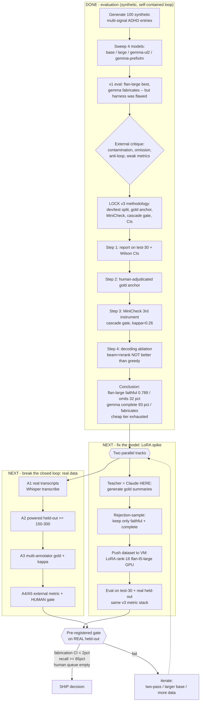

# Roadmap — what we did, what's next

Open in the IDE markdown preview to render the diagram.

## Legend
- **DONE** = the evaluation, all on synthetic data inside a Claude-only loop. Conclusion is defensible *relatively* (flan-large is safest) but not ship-certified.
- **FIX track** = make flan-large complete without losing faithfulness (LoRA). Can start on existing data.
- **LOOP track** = replace the self-referential pieces with external anchors (real data, human annotators, human gate). The one thing Claude cannot be.
- **GATE** = both tracks reconverge here; a ship decision needs *real* data + a pre-registered bar, not synthetic self-evaluation.
