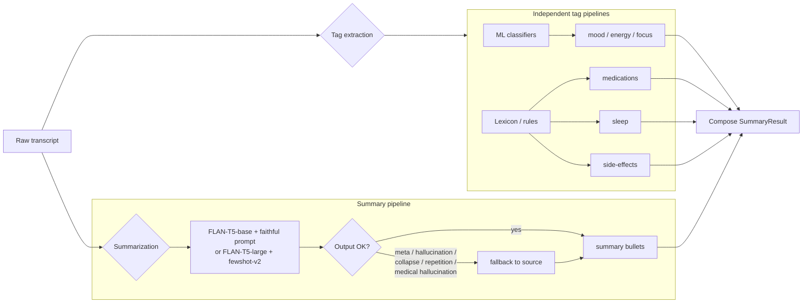

# Summary pipeline architecture

## How it works

1. **Same input, parallel pipelines.** The raw transcript feeds three independent systems:
   - ML classifiers for mood / energy / focus
   - Lexicon/rules for sleep, medications, side-effects
   - FLAN-T5 for the bullet summary

2. **They do not depend on each other.** If the ML classifiers abstain (`mood: null`), the summary still runs.

3. **Faithful extractor.** The summary prompt asks FLAN-T5 to use the user's own words and not invent details.

4. **Fallback guard.** If the model outputs meta-language ("the journal entry is about...", "bullets:"), hallucinates words ("water"), collapses a long entry to a platitude, repeats a phrase in a loop, or makes a high-hallucination claim about medications, the fallback replaces it with the user's original text.

5. **Compose at the end.** Tags and bullets are merged into the final `SummaryResult` only after all three pipelines finish.
